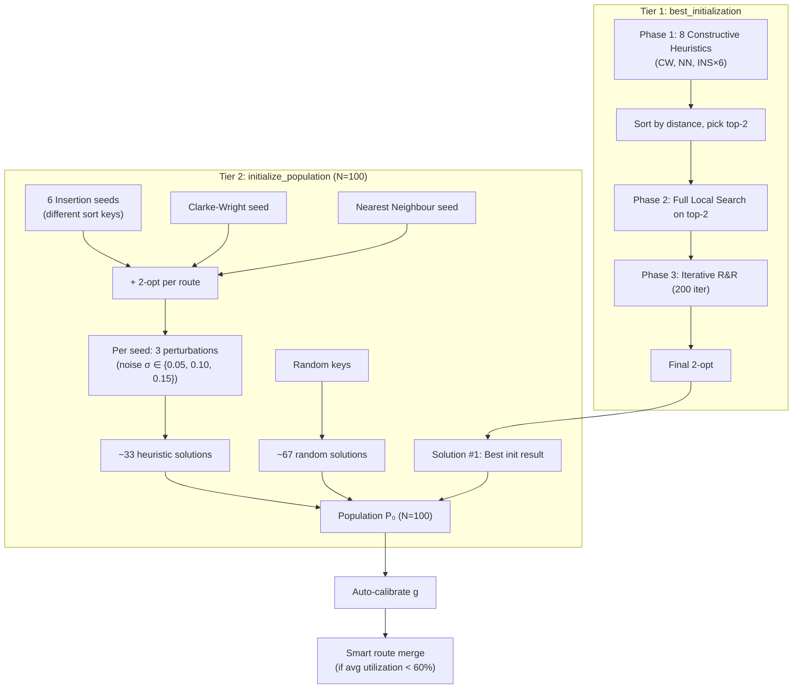
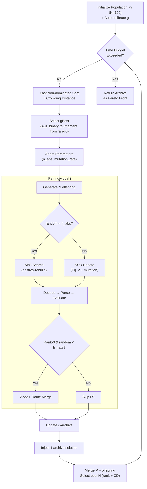

# Preference-Based improved Non-dominated Sorting Squirrel Search Optimization (iNSSSO) for Multi-Objective VRPTW

> **Algorithm Documentation — Q1 Paper Reference**
> Based on source code implementation at [code](file:///g:/BaoCaoLuanVanThs/code_new/code)

---

## 1. Problem Formulation

### 1.1. Multi-Objective VRPTW (MO-VRPTW)

Given a set of $n$ customers $C = \{1, 2, \ldots, n\}$ and a depot (node 0), each customer $i$ has coordinates $(x_i, y_i)$, demand $q_i$, time window $[e_i, l_i]$, and service time $s_i$. A fleet of $K$ identical vehicles with capacity $Q$ serves all customers, starting and ending at the depot.

**Three objectives (all minimized):**

| Objective | Formula | Description |
|-----------|---------|-------------|
| $f_1$ — Total Distance | $f_1 = \sum_{k=1}^{K} \sum_{(i,j) \in \text{route}_k} d_{ij}$ | Sum of Euclidean distances across all routes |
| $f_2$ — Customer Dissatisfaction | $f_2 = \frac{1}{n} \sum_{k=1}^{K} \sum_{i \in \text{route}_k} w_i$ | Average waiting time $w_i = \max(0, e_i - a_i)$ where $a_i$ is arrival time |
| $f_3$ — Workload Imbalance | $f_3 = \frac{1}{\|\sigma\|} \sum_{k \in \sigma} \frac{T_{\max} - T_k}{T_{\max}}$ | Normalized deviation of completion times $T_k$ from maximum $T_{\max}$ |

> [!NOTE]
> An alternative $f_3$ formulation is available: $f_3 = \sum_k |T_k - T_{\text{avg}}|$ (absolute deviation from mean). Controlled by parameter `use_eq17`.

**Constraints (hard):**
- **Capacity:** $\sum_{i \in \text{route}_k} q_i \leq Q, \quad \forall k$
- **Time windows:** $a_i \leq l_i, \quad \forall i$ (vehicle may wait if arriving early)
- **Depot return:** $T_k \leq l_0$ (must return before depot closes)

### 1.2. Distance and Travel Time Matrices

Both matrices are precomputed using Euclidean distance:

$$d_{ij} = \sqrt{(x_i - x_j)^2 + (y_i - y_j)^2}, \quad t_{ij} = d_{ij} / v$$

where $v = 1.0$ (unit speed) is the default for Solomon benchmarks.

---

## 2. Solution Encoding and Decoding

### 2.1. Random-Key Encoding

Each solution is represented as a real-valued vector $X = (x_1, x_2, \ldots, x_{n_{\text{var}}})$ where $x_j \in [0, 1)$ and:

$$n_{\text{var}} = |C| + |K| - 1 = n + K - 1$$

This representation enables continuous-domain operators (SSO, polynomial mutation) to be applied directly on the key vector.

### 2.2. Decoding Process

1. **Argsort:** Compute $Z = \text{argsort}(X) + 1$ — a permutation of $\{1, 2, \ldots, n_{\text{var}}\}$
2. **Separation:** Values $z > n$ are **route separators**; values $z \leq n$ are **customer IDs**
3. **Route construction:** Customers between consecutive separators form individual routes

**Example** ($n = 5$, $K = 3$, $n_{\text{var}} = 7$):
```
X    = [0.32, 0.85, 0.14, 0.67, 0.91, 0.43, 0.58]
Z    = argsort(X) + 1 = [3, 1, 6, 4, 7, 2, 5]
                          ↓  ↓  ↓  ↓  ↓  ↓  ↓
Customer IDs (≤5):        3  1  .  4  .  2  5
Separators (>5):              .  6  .  7      
→ Routes: [[3, 1], [4], [2, 5]]
```

### 2.3. Reverse Encoding (Routes → Keys)

Given a desired route-set, random keys are assigned such that $\text{argsort}(\text{keys}) + 1$ reproduces the sequence $Z$:

$$\text{keys}[\text{pos}] \sim \mathcal{U}\left(\frac{\text{rank}}{n_{\text{var}}}, \frac{\text{rank}+1}{n_{\text{var}}}\right)$$

where $\text{pos} = z_i - 1$ and $\text{rank}$ is the position in $Z$. This ensures strict ordering while adding stochastic variation.

### 2.4. Feasibility Repair

After decoding, a **SolutionParser** validates each route by walking through customers sequentially:
- Check capacity: $\text{load} + q_i \leq Q$
- Check time window: $\max(a_i, e_i) \leq l_i$
- Check depot return: $\max(a_i, e_i) + s_i + t_{i,0} \leq l_0$

Infeasible customers are moved to an `unassigned` list. Missing customers (not in any route) are also added. The penalty $P = 10^4 \times |\text{unassigned}|$ is added to each objective.

---

## 3. Preference Model

### 3.1. User Preference Structure

The decision-maker's preference is defined by three parameters:

| Parameter | Symbol | Description |
|-----------|--------|-------------|
| Reference Point | $g = [g_1, g_2, g_3]$ | Aspiration values for each objective |
| Weight Vector | $w = [w_1, w_2, w_3]$, $\sum w_i = 1$ | Relative importance of each objective |
| ROI Radius | $\delta$ | Size of the preferred region around $g$ |

### 3.2. Achievement Scalarizing Function (ASF)

$$\text{ASF}(x, g, w) = \max_{i=1}^{M} \left\{ w_i \cdot (f_i(x) - g_i) \right\}$$

**Augmented ASF** (for tie-breaking):

$$\text{ASF}_{\text{aug}}(x) = \max_{i} \{w_i (f_i - g_i)\} + \rho \sum_{i} w_i (f_i - g_i), \quad \rho = 10^{-3}$$

**Batch computation** (vectorized NumPy):
```python
deviations = w[np.newaxis, :] * (objectives - g[np.newaxis, :])  # (N, M)
ASF_batch = np.max(deviations, axis=1) + ρ * np.sum(deviations, axis=1)  # (N,)
```

**Roles in the algorithm:**
1. **gBest selection:** Choose leader with minimum ASF from rank-0 front
2. **Archive pruning:** When archive exceeds capacity, keep solutions with lowest ASF
3. **Stagnation detection:** Track $\min(\text{ASF})$ across generations
4. **Convergence metric:** Log $\min(\text{ASF})$ per generation

### 3.3. Region of Interest (ROI)

A hyper-ellipsoidal region around $g$:

$$\sum_{i=1}^{M} \left( \frac{w_i \cdot (f_i(x) - g_i)}{\delta \cdot (\text{nadir}_i - \text{ideal}_i)} \right)^2 \leq 1$$

where $\text{ideal}_i = \min_x f_i(x)$ and $\text{nadir}_i = \max_x f_i(x)$ are computed from the current population.

### 3.4. Auto-Calibration of Reference Point

The reference point $g$ is automatically calibrated from the initial population:

$$g_i = \text{ideal}_i + 0.1 \times \max(p_{10,i} - \text{ideal}_i, \; 0)$$

where $p_{10}$ is the 10th percentile per objective among **feasible solutions** ($|\text{unassigned}| = 0$). A minimum shift of 1% of the objective range is enforced:

$$g_i = \max\left(g_i, \; \text{ideal}_i + 0.01 \times (\max_i - \text{ideal}_i)\right)$$

---

## 4. Population Initialization

### 4.1. Overview

The initialization is a **two-tier multi-start** strategy combining constructive heuristics, local search, and perturbation-based diversification.



### 4.2. Constructive Heuristics

#### 4.2.1. Clarke-Wright Savings Algorithm

1. Initialize $n$ routes, each serving exactly one customer
2. Compute savings: $s_{ij} = d_{0i} + d_{0j} - d_{ij}$ for all pairs $(i,j)$
3. Sort savings in descending order
4. Iterate: merge routes of $i$ and $j$ if endpoints match and merged route is feasible
5. Test 4 merge orientations: head-tail, tail-head, tail-tail (reverse), head-head (reverse)

**Complexity:** $O(n^2 \log n)$ for sorting savings, plus $O(n^2)$ merging attempts.

#### 4.2.2. Sequential Insertion Heuristic

1. Sort customers by a chosen key $\kappa$ (6 variants)
2. For each customer in sorted order: find the route and position with minimum insertion cost
3. If no feasible insertion exists, create a new route

| Sort Key | Customer Ordering | Intuition |
|----------|-------------------|-----------|
| `due_date` | Earliest deadline first | Prioritize urgent customers |
| `ready_time` | Earliest ready time first | Follow temporal order |
| `demand` | Largest demand first | Pack heavy customers first |
| [distance](file:///g:/BaoCaoLuanVanThs/code_new/code/algorithm/init_heuristics.py#54-60) | Closest to depot first | Build tight clusters |
| `angle` | Polar angle from depot | Sweep-based clustering |
| `tw_center` | $(e_i + l_i)/2$ increasing | Balance time-window centers |

#### 4.2.3. Greedy Nearest Neighbour

For each new route:
1. Start at depot, set current time $t=0$, load $q=0$
2. Among unvisited feasible customers, select the one minimizing:
$$\text{score}(i) = \max(a_i, e_i) + 0.5 \cdot d_{\text{prev}, i}$$
3. Update time and load; repeat until no feasible insertion
4. Start new route for remaining customers

### 4.3. [best_initialization()](file:///g:/BaoCaoLuanVanThs/code_new/code/algorithm/init_heuristics.py#578-643) — Elite Seed Generation

**Time allocation:** $\min(0.4 \times t_{\text{run}}, 15\text{s})$

| Phase | Description | Time Budget |
|-------|-------------|-------------|
| 1 | Generate candidates from all 8 heuristics | Fast (no LS) |
| 2 | Full Local Search on top-2 candidates | 70% of remaining |
| 3 | Iterative Ruin-and-Recreate (200 iterations) | Remaining time |
| Final | 2-opt on every route | Negligible |

### 4.4. Perturbation for Diversification

Each heuristic seed produces 3 additional solutions by adding uniform noise to random keys:

$$x_j^{\text{new}} = \text{clip}(x_j + \varepsilon_j, \; 0, \; 0.999), \quad \varepsilon_j \sim \mathcal{U}(-\sigma, \sigma)$$

with $\sigma \in \{0.05, 0.10, 0.15\}$.

### 4.5. Population Composition

| Component | Count | Proportion | Quality |
|-----------|-------|------------|---------|
| Best initialization (with LS + R&R) | 1 | 1% | Very high |
| Insertion heuristic seeds (6 keys × 4) | 24 | 24% | Medium-high |
| Clarke-Wright seed + perturbations | 4 | 4% | Medium-high |
| Nearest Neighbour seed + perturbations | 4 | 4% | Medium |
| Random solutions | 67 | 67% | Low (diversity) |
| **Total** | **100** | **100%** | — |

### 4.6. Smart Route Merging

Applied when average capacity utilization is low ($< 60\%$):

1. Sort routes by length (ascending)
2. For the shortest route: try to insert all its customers into other routes
3. Accept merge if total distance increase $\leq 5\%$
4. Apply 2-opt on merged routes; repeat up to 5 attempts

---

## 5. Main Evolutionary Loop

### 5.1. Algorithm Overview



### 5.2. Hybrid Preference Strategy

The algorithm uses a **hybrid approach** combining standard Pareto sorting (for speed and diversity) with ASF-guided components (for preference convergence):

| Component | Method | Purpose |
|-----------|--------|---------|
| **Ranking** | Fast non-dominated sort + Crowding Distance | Maintain diversity, $O(MN^2)$ |
| **gBest Selection** | ASF binary tournament from rank-0 | Direct SSO towards preferred region |
| **Archive** | ε-dominance + ASF tie-breaking | Store preferred non-dominated solutions |
| **ABS Search** | Preference-weighted scoring $f = w_1 d + w_2 \text{tw} + w_3 h$ | Destroy-rebuild biased towards preference |
| **Selection** | Standard Pareto rank + CD | Fast environmental selection |

> [!IMPORTANT]
> R-Dominance sorting is implemented ([r_dominance.py](file:///g:/BaoCaoLuanVanThs/code_new/code/algorithm/r_dominance.py)) but **not active** in the hybrid strategy. The hybrid approach uses standard Pareto sort for ranking/selection and injects preference only through ASF-based gBest and archive. This avoids the $O(N^2)$ overhead of R-Dominance while still guiding search effectively.

### 5.3. Non-dominated Sorting (Vectorized)

Deb's fast non-dominated sort, implemented with NumPy broadcasting:

```python
# Vectorized pairwise dominance matrix (N, N)
a = objectives[:, np.newaxis, :]  # (N, 1, M)
b = objectives[np.newaxis, :, :]  # (1, N, M)
dom = (a <= b).all(axis=2) & (a < b).any(axis=2)  # (N, N)
```

**Complexity:** $O(MN^2)$ computation, $O(N^2)$ memory.

### 5.4. Crowding Distance

Normalized crowding distance computation:

1. For each front, normalize each objective to $[0, 1]$
2. For each objective $m$: sort solutions, set boundary solutions to $\infty$
3. For interior solutions: $\text{CD}_i += \frac{f_m^{i+1} - f_m^{i-1}}{f_m^{\max} - f_m^{\min}}$
4. Duplicate solutions (within $\varepsilon = 10^{-6}$) are penalized in selection

### 5.5. gBest Selection

**Binary tournament** on the Pareto-optimal front (rank-0):

- **With preference:** Compete on ASF score — lower ASF wins
- **Without preference:** Compete on crowding distance — higher CD wins
- **Vehicle count priority:** Fewer routes always beats more routes (hierarchical)

### 5.6. SSO Update Operator (Eq. 2)

For each variable $j$ of solution $x_i$:

$$x_{i,j}^{\text{new}} = \begin{cases}
g_{\text{best},j} & \text{if } \rho_j \leq c_g \; (= 0.95) \\
x_{i,j} & \text{if } c_g < \rho_j \leq c_w \; (= 0.99) \\
\mathcal{U}(0,1) & \text{if } \rho_j > c_w
\end{cases}$$

where $\rho_j \sim \mathcal{U}(0,1)$ independently for each variable.

| Parameter | Value | Effect |
|-----------|-------|--------|
| $c_g$ | 0.95 | 95% chance of copying gBest key → strong exploitation |
| $c_w$ | 0.99 | 4% chance of keeping own key → mild exploration |
| $1 - c_w$ | 0.01 | 1% chance of random key → rare diversity injection |

**Vectorized implementation** using `np.where`:
```python
rho = np.random.rand(nvar)
new_keys = np.where(rho <= cg, gbest.keys,
           np.where(rho <= cw, xi.keys, np.random.rand(nvar)))
```

### 5.7. Polynomial Mutation (Diversity Operator)

Adapted from NSGA-II, applied to each key variable independently with probability $p_m$:

$$x_j' = x_j + \delta_q, \quad \delta_q = \begin{cases}
(2r + (1-2r)(1-\delta_1)^{\eta_m+1})^{1/(\eta_m+1)} - 1 & \text{if } r < 0.5 \\
1 - (2(1-r) + 2(r-0.5)(1-\delta_2)^{\eta_m+1})^{1/(\eta_m+1)} & \text{if } r \geq 0.5
\end{cases}$$

where $\delta_1 = x_j$, $\delta_2 = 1 - x_j$, $\eta_m = 20$ (distribution index), $r \sim \mathcal{U}(0,1)$.

**Trigger:** Only applied when stagnation count $> 3$ and $\text{random} < p_m$.

---

## 6. A*-Based Search (ABS) — Preference-Aware Local Search

### 6.1. Overview

ABS is a **destroy-and-rebuild** local search with preference-guided customer selection. It is applied with probability $p_{\text{abs}}$ (adaptive, base = 0.20).

### 6.2. Destruction Phase

Two strategies selected probabilistically:

| Strategy | Probability | Method |
|----------|-------------|--------|
| **Worst Removal** | 40% | Remove 15–35% of customers with highest distance savings |
| **Route Removal** | 60% | Remove $\lfloor|\tau|/3\rfloor$ routes, probability $\propto \exp(-10 \cdot n_k / n_{\max})$ |

**Worst Removal — savings calculation:**
$$\text{saving}(c_i) = d_{\text{prev}, c_i} + d_{c_i, \text{next}} - d_{\text{prev}, \text{next}}$$

Sort by savings descending, remove top-$k$ customers.

**Route Removal — selection probability (Eq. 18):**
$$P(\text{select route } k) = \frac{\exp(-10 \cdot n_k / n_{\max})}{\sum_j \exp(-10 \cdot n_j / n_{\max})}$$

Shorter routes are exponentially more likely to be removed.

### 6.3. Reconstruction Phase — Build Route (Table 3)

For each new route, iteratively select customers from the unassigned pool:

**Step 1 — Feasibility Check (calVcost, Table 4):**
- Capacity: $\text{load} + q_i \leq Q$
- Time window: $\max(a_i, e_i) \leq l_i$
- Depot return: $\max(a_i, e_i) + s_i + t_{i,0} \leq l_0$

**Step 2 — Heuristic Estimate (calHcost, Table 5):**
$$h(c_i) = |\{c_j \in \text{open} : c_j \text{ can still be served after visiting } c_i\}|$$

Counts reachable remaining customers — higher $h$ means more flexibility.

**Step 3 — Composite Score (Preference-Weighted):**

$$f(c_i) = w_1 \cdot \hat{g}(c_i) + w_2 \cdot \hat{tw}(c_i) + (1 - w_1 - w_2) \cdot \hat{h}(c_i)$$

where:
- $\hat{g}(c_i) = g(c_i) / g_{\max}$ — normalized distance from current position
- $\hat{tw}(c_i) = (l_i - e_i)^{-1} / \max_j (l_j - e_j)^{-1}$ — normalized TW urgency
- $\hat{h}(c_i) = (h_{\max} - h(c_i)) / h_{\max}$ — inverted normalized reachability

**Step 4 — Roulette-Wheel Selection:**

$$P(\text{select } c_i) = \frac{f_{\max} - f(c_i) + \varepsilon}{\sum_j (f_{\max} - f(c_j) + \varepsilon)}$$

**Step 5 — Stopping Criterion:**
- No more feasible candidates, OR
- Current route makespan $\geq$ average makespan of kept routes (balance)

### 6.4. Post-Processing

1. **Regret-2 Insertion** for remaining unassigned customers:
   - For each unassigned customer, compute insertion cost in all routes/positions
   - Regret = $\text{cost}_2 - \text{cost}_1$ (difference between best and second-best insertion)
   - Insert customer with highest regret first (most urgent)
2. **Quick 2-opt** on all rebuilt routes (single pass)

---

## 7. Local Search Pipeline

### 7.1. Intra-Route Operators

| Operator | Description | Complexity |
|----------|-------------|------------|
| **2-opt** | Reverse a sub-segment within a route; repeat until no improvement | $O(n_r^2)$ per pass |
| **Or-opt** | Move a segment of 1–3 consecutive customers to another position | $O(n_r^2 \times 3)$ per pass |

### 7.2. Inter-Route Operators

| Operator | Description | Time Limit |
|----------|-------------|------------|
| **Relocate** | Move one customer from route $A$ to route $B$ | 5s default |
| **Swap** | Exchange one customer between two routes | 5s default |
| **Cross-Exchange (2-opt*)** | Swap tails between two routes at cut points | 5s default |

### 7.3. Ruin-and-Recreate

1. **Destroy:** Remove $15\%$–$40\%$ of customers randomly
2. **Recreate:** Sort removed by due-date (tightest first), insert at cheapest feasible position
3. **Post-pass:** 2-opt on all affected routes
4. **Iterate:** Keep best solution over 50–200 iterations

### 7.4. Full Local Search Pipeline (per call)

```
REPEAT until no improvement:
  1. Intra-route: 2-opt → Or-opt (all routes)
  2. Inter-route: Relocate → Swap → Cross-Exchange
  3. Ruin-and-Recreate (iterative)
  4. Post-pass: 2-opt on all routes
  (time budget shared: remaining/4 per operator)
```

### 7.5. Local Search in Main Loop

- **Rank-0 solutions:** LS probability = 10%
- **Other ranks:** LS probability = 3%
- **Only feasible** solutions ($|\text{unassigned}| = 0$) receive LS
- LS consists of: 2-opt per route + Smart route merge (if utilization < 60%)

---

## 8. External Archive (ε-Dominance)

### 8.1. ε-Box Mapping

Objectives are mapped to discrete boxes:

$$\text{box}(x) = \left\lfloor \frac{f_i(x)}{\varepsilon} \right\rfloor, \quad \varepsilon = 0.001$$

### 8.2. Archive Update Rules

For a new candidate solution $x$ and each archive member $m$:

| Condition | Action |
|-----------|--------|
| Same ε-box as $m$ and $\text{ASF}(x) < \text{ASF}(m)$ | Replace $m$ with $x$ |
| Same ε-box and $\text{ASF}(x) \geq \text{ASF}(m)$ | Reject $x$ |
| $m$ dominates $x$ | Reject $x$ |
| $x$ dominates $m$ | Remove $m$ |
| None of the above | Add $x$ to archive |

### 8.3. Archive Pruning (when size > 200)

- **With preference:** Sort by ASF, keep top-200 (closest to $g$)
- **Without preference:** Sort by crowding distance (descending), keep top-200

### 8.4. Archive Injection

Each generation, one random archive solution is injected into the offspring pool to promote diversity and prevent loss of good solutions.

---

## 9. Adaptive Parameter Control

### 9.1. Stagnation Detection

Stagnation is detected when the best ASF score does not improve for $\geq 5$ consecutive generations:

$$|\text{ASF}_{\text{best}}^{(t)} - \text{ASF}_{\text{best}}^{(t-1)}| < 10^{-6}$$

### 9.2. Parameter Adaptation Rules

| Parameter | Base Value | Adaptation |
|-----------|------------|------------|
| $p_{\text{abs}}$ (ABS probability) | 0.20 | $\min(0.50, \; 0.20 + 0.05 \times \text{stag\_count})$ when stagnating |
| $p_m$ (mutation rate) | 0.05 | $0.05 + 0.10 \times \text{progress}$, where $\text{progress} = t_{\text{elapsed}} / t_{\text{run}} \in [0,1]$ |
| LS rate (rank-0) | 0.10 | Fixed |
| LS rate (other) | 0.03 | Fixed |

### 9.3. Mutation Trigger

Polynomial mutation is applied only when:
1. Stagnation count $> 3$, AND
2. $\text{random} < p_m$ (current mutation rate)

---

## 10. Selection Mechanism

### 10.1. Environmental Selection (μ + λ)

After generating $N$ offspring, merge parent and offspring populations ($2N + 1$ with archive injection):

**Sort criteria (lexicographic):**
1. **Vehicle count** (if available) — fewer routes preferred
2. **Duplicate flag** — unique solutions first
3. **Pareto rank** — lower rank preferred
4. **Crowding distance** — higher CD preferred (diversity)

Select top-$N$ solutions for next generation.

### 10.2. Duplicate Elimination

Solutions with all objectives within $\varepsilon = 10^{-6}$ of another solution are flagged as duplicates and penalized in selection, ensuring population diversity.

---

## 11. R-Dominance (Available Module)

Although not used in the main hybrid loop, R-Dominance is implemented for optional use:

$$x \text{ R-dominates } y \iff \begin{cases}
(1) & x \text{ Pareto-dominates } y, \text{ OR} \\
(2) & x \in \text{ROI} \text{ and } y \notin \text{ROI}, \text{ OR} \\
(3) & \text{same ROI status and } \text{ASF}(x) < \text{ASF}(y)
\end{cases}$$

**Vectorized implementation** using NumPy broadcasting:
```python
r_dom = pareto_dom | roi_dom | asf_dom  # (N, N) boolean matrix
```

Selection with R-Dominance uses the priority: R-rank → ASF → Crowding Distance.

---

## 12. Performance Metrics

| Metric | Formula | Purpose |
|--------|---------|---------|
| **Coverage (Cov)** | $\frac{|\{v \in P^* : \exists v' \in P_A, v' \preceq v\}|}{|P^*|}$ | Fraction of true front covered |
| **IGD** | $\frac{1}{|P^*|} \sum_{v \in P^*} \min_{v' \in P_A} \|v - v'\|$ | Distance to true front (normalized) |
| **HV** | $\text{Vol}\left(\bigcup_{v \in P_A} [v, r]\right)$ | Volume dominated by PF (pymoo) |
| **R-HV** | HV restricted to ROI solutions | Preference-specific coverage |
| **Best ASF** | $\min_{x \in P_A} \text{ASF}(x, g, w)$ | Closest solution to preference |
| **ROI Count** | $|\{x \in P_A : x \in \text{ROI}\}|$ | Solutions in preferred region |
| **Nnds** | Size of rank-0 front | Pareto front cardinality |

---

## 13. Algorithm Parameters Summary

| Parameter | Symbol | Default | Description |
|-----------|--------|---------|-------------|
| Population size | $N$ | 100 | Number of solutions |
| Time budget | $t_{\text{run}}$ | 60s | Maximum runtime |
| SSO copy rate | $c_g$ | 0.95 | Probability of copying gBest key |
| SSO keep rate | $c_w$ | 0.99 | Probability of keeping own key |
| ABS probability base | $p_{\text{abs}}$ | 0.20 | Base probability of ABS vs SSO |
| Archive size | — | 200 | Maximum external archive capacity |
| ε-dominance | $\varepsilon$ | 0.001 | ε-box granularity |
| LS rate (rank-0) | — | 0.10 | Local search probability for Pareto-optimal |
| LS rate (others) | — | 0.03 | Local search probability for dominated |
| Mutation rate base | $p_m$ | 0.05 | Base polynomial mutation rate |
| Mutation index | $\eta_m$ | 20 | Polynomial mutation distribution index |
| ROI radius | $\delta$ | 0.10 | Preference region size |
| Penalty | $P$ | $10^4$ | Per-unserved-customer penalty |

---

## 14. Computational Complexity

| Component | Per-Generation Cost |
|-----------|-------------------|
| Non-dominated sort | $O(MN^2)$ — vectorized |
| Crowding distance | $O(MN\log N)$ per front |
| SSO update | $O(N \cdot n_{\text{var}})$ — vectorized |
| ABS search | $O(p_{\text{abs}} \cdot N \cdot n^2)$ — destroy/rebuild |
| Archive update | $O(|A| \cdot N)$ — pairwise checks |
| Selection | $O(2N \log(2N))$ — sorting |
| **Total per generation** | **$O(MN^2 + p_{\text{abs}} N n^2)$** |

---

## 15. File Structure

```
core/
  problem.py         ← VRPTWInstance, Customer, Solomon loader
  solution.py        ← Random-key encoding/decoding, SolutionParser
  objectives.py      ← FitnessEvaluator (f₁, f₂, f₃)
  preference.py      ← UserPreference, ASF, ROI

algorithm/
  inssso.py          ← Main iNSSSO class, ParetoArchive, main loop
  init_heuristics.py ← CW, NN, Insertion, 2-opt, Or-opt, Relocate,
                        Swap, Cross-Exchange, R&R, Route Merge,
                        Full LS, best_initialization
  abs_search.py      ← ABS destroy-rebuild with preference scoring
  crowding.py        ← Crowding distance, select_best, select_gbest
  nondominated.py    ← Vectorized fast non-dominated sort
  r_dominance.py     ← R-Dominance sort (available, not in hybrid)

benchmark/
  metrics.py         ← Cov, IGD, HV, R-HV, ASF, ROI Count, Nnds
```
