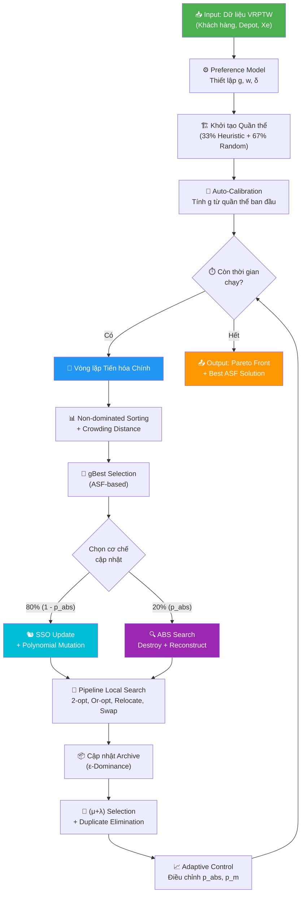
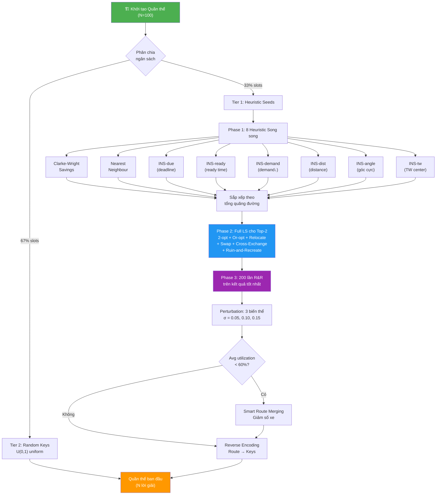
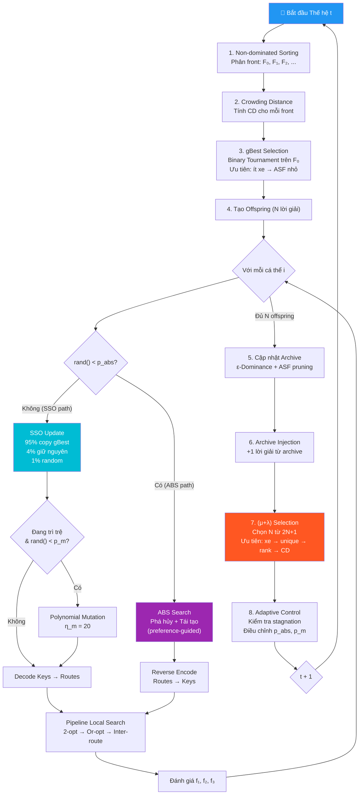
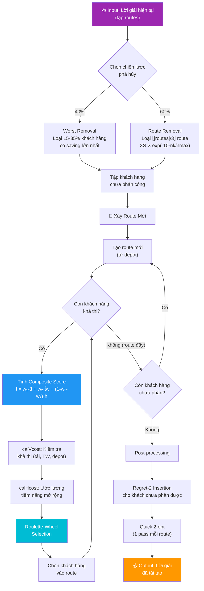
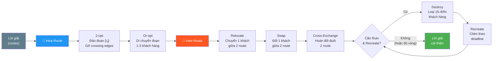
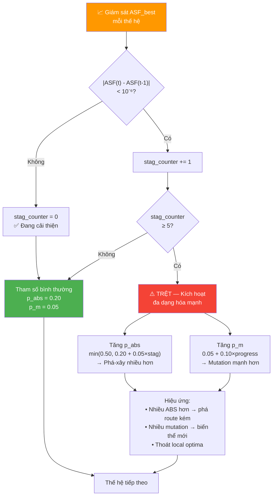

# Thuật toán iNSSSO cho bài toán MO-VRPTW — Tài liệu Chi tiết

> **Tài liệu phục vụ viết bài báo Q1**
> Mã nguồn: [code](file:///g:/BaoCaoLuanVanThs/code_new/code)

---

## 1. Phát biểu Bài toán (Problem Formulation)

### 1.1. Bài toán MO-VRPTW

**Vehicle Routing Problem with Time Windows (VRPTW)** là bài toán tối ưu tổ hợp NP-hard kinh điển trong logistics. Cho $n$ khách hàng và 1 kho (depot), mỗi khách hàng $i$ có:
- Tọa độ $(x_i, y_i)$
- Nhu cầu hàng hóa $q_i$
- Cửa sổ thời gian $[e_i, l_i]$: chỉ được bắt đầu phục vụ trong khoảng này
- Thời gian phục vụ $s_i$

Đội xe gồm $K$ xe đồng nhất, mỗi xe có tải trọng tối đa $Q$. Mỗi xe xuất phát từ depot, phục vụ một tập khách hàng, rồi quay về depot.

### 1.2. Ba mục tiêu tối ưu (đều cực tiểu hóa)

#### Mục tiêu 1: Tổng quãng đường — $f_1$

$$f_1 = \sum_{k=1}^{K} \sum_{(i,j) \in \text{route}_k} d_{ij}$$

**Ý nghĩa:** Tối thiểu hóa chi phí vận chuyển. Đây là mục tiêu phổ biến nhất trong VRP — liên quan trực tiếp đến chi phí nhiên liệu, thời gian lái xe, và khí thải CO₂. Trong thực tế, giảm 1% quãng đường có thể tiết kiệm hàng triệu đồng cho các công ty logistics.

#### Mục tiêu 2: Sự bất mãn khách hàng — $f_2$

$$f_2 = \frac{1}{n} \sum_{k=1}^{K} \sum_{i \in \text{route}_k} w_i, \quad w_i = \max(0, \; e_i - a_i)$$

**Ý nghĩa:** Thời gian chờ $w_i$ xảy ra khi xe đến sớm ($a_i < e_i$), phải chờ đến $e_i$ mới được phục vụ. Thời gian chờ lớn → xe bị "nhàn rỗi" → lãng phí nguồn lực. Tuy nhiên, nếu tối ưu $f_1$ quá mạnh (đường đi ngắn nhất), xe sẽ chạy nhanh đến các khách hàng gần nhau dù phải chờ lâu. $f_2$ cân bằng điều này — khuyến khích lộ trình "vừa đủ" về thời gian.

> [!NOTE]
> $f_2$ là **trung bình** thời gian chờ (chia cho $n$), không phải tổng. Điều này giúp $f_2$ không phụ thuộc vào kích thước bài toán, dễ so sánh giữa các instance.

#### Mục tiêu 3: Độ lệch tải trọng công việc — $f_3$

$$f_3 = \frac{1}{|\sigma|} \sum_{k \in \sigma} \frac{T_{\max} - T_k}{T_{\max}}$$

trong đó $T_k$ là thời gian hoàn thành route $k$, $T_{\max} = \max_k T_k$, $\sigma$ = tập xe được sử dụng.

**Ý nghĩa:** Đảm bảo công bằng giữa các tài xế. Nếu một xe chạy 8 tiếng trong khi xe khác chỉ chạy 2 tiếng → bất công. $f_3 = 0$ khi tất cả route có cùng $T_k$ (hoàn toàn cân bằng). $f_3$ gần 1 khi hầu hết route rất ngắn so với route dài nhất.

**Công thức thay thế (Eq. 5):** $f_3 = \sum_k |T_k - T_{\text{avg}}|$ — tổng độ lệch tuyệt đối so với trung bình. Dùng khi muốn phạt cả route dài lẫn route ngắn bất thường.

### 1.3. Ràng buộc cứng

| Ràng buộc | Công thức | Ý nghĩa thực tế |
|-----------|-----------|------------------|
| **Tải trọng** | $\sum_{i \in \text{route}_k} q_i \leq Q$ | Xe không được chở quá tải |
| **Cửa sổ thời gian** | $\max(a_i, e_i) \leq l_i$ | Phải đến trước giờ đóng cửa |
| **Quay về depot** | $T_k \leq l_0$ | Xe phải về kho trước giờ đóng |

**Xử lý vi phạm:** Khách hàng vi phạm bị đưa vào danh sách `unassigned`. Mỗi khách hàng chưa được phục vụ bị phạt $P = 10^4$ cộng vào mỗi mục tiêu → thuật toán ưu tiên phục vụ tất cả trước khi tối ưu.

### 1.4. Tại sao đa mục tiêu?

Ba mục tiêu **mâu thuẫn** với nhau:
- Tối ưu $f_1$ (đường ngắn) → xe phục vụ cụm khách gần nhau → một số xe rất bận, một số rất nhàn → $f_3$ tăng
- Tối ưu $f_2$ (ít chờ) → xe đến đúng lúc → có thể phải đi đường vòng → $f_1$ tăng
- Tối ưu $f_3$ (cân bằng) → chia đều công việc → route không theo cụm tối ưu → $f_1$ tăng

Do đó, không tồn tại lời giải tối ưu duy nhất, mà tồn tại một **tập Pareto** — tập các lời giải mà không lời giải nào tốt hơn ở TẤT CẢ mục tiêu.

### 1.5. Tổng quan Workflow Thuật toán

Trước khi đi sâu vào từng thành phần, phần này cung cấp các biểu đồ tổng quan mô tả **luồng hoạt động** (workflow) của toàn bộ thuật toán iNSSSO và các module con. Mỗi biểu đồ tương ứng với một phần chi tiết trong tài liệu.

#### 1.5.1. Biểu đồ tổng quan — Pipeline iNSSSO

Biểu đồ dưới đây thể hiện luồng xử lý chính của thuật toán từ khi nhận input đến khi trả về kết quả Pareto front cuối cùng.



**Giải thích workflow chi tiết:**

**Bước 1 — Input & Preference Model:** Thuật toán nhận dữ liệu VRPTW từ file Solomon benchmark (tọa độ, nhu cầu, time window, thời gian phục vụ của $n$ khách hàng, cùng thông số xe $K$, $Q$). Song song, DM cung cấp preference: điểm tham chiếu $g = [g_1, g_2, g_3]$ thể hiện mong muốn cho 3 mục tiêu, vector trọng số $w = [w_1, w_2, w_3]$ thể hiện mức quan trọng tương đối, và bán kính ROI $\delta$ kiểm soát vùng tìm kiếm. Nếu DM không cung cấp, hệ thống auto-calibrate ở bước 3.

**Bước 2 — Khởi tạo Quần thể ($N = 100$):** Quần thể được chia thành 2 tầng: **Tier 1** (~33 lời giải) được sinh từ các heuristic xây dựng (Clarke-Wright, Nearest Neighbour, 6 Insertion variants) và đã qua local search nặng — đóng vai trò "hạt giống chất lượng cao"; **Tier 2** (~67 lời giải) là random keys $\sim \mathcal{U}(0,1)$ — đóng vai trò đảm bảo đa dạng, phủ các vùng không gian mà heuristic chưa khám phá. Tỷ lệ 33/67 được thiết kế để cân bằng exploitation (bắt đầu từ vùng tốt) vs exploration (không bị kẹt sớm).

**Bước 3 — Auto-Calibration:** Sau khi có quần thể ban đầu, hệ thống phân tích giá trị 3 mục tiêu của tất cả lời giải khả thi, tính ideal point (min mỗi mục tiêu) và phân vị thứ 10. Điểm tham chiếu $g$ được hiệu chỉnh: $g_i = \text{ideal}_i + 0.1 \times (p_{10,i} - \text{ideal}_i)$. Bước này đảm bảo $g$ vừa "tham" (gần ideal) nhưng vẫn "khả thi" (dựa trên phân bố thực tế), tránh trường hợp DM đặt $g$ quá lý tưởng khiến ASF vô nghĩa.

**Bước 4 — Vòng lặp Tiến hóa:** Đây là phần cốt lõi, chạy cho đến khi hết ngân sách thời gian $t_{\text{run}}$ (thường 60s). Mỗi thế hệ gồm 8 bước tuần tự:
- **(4a)** Non-dominated Sorting phân quần thể thành các front $F_0, F_1, \ldots$ theo quan hệ Pareto dominance
- **(4b)** Crowding Distance tính cho mỗi front để đánh giá mật độ — lời giải ở vùng thưa được ưu tiên
- **(4c)** gBest Selection chọn lời giải "lãnh đạo" từ $F_0$ bằng binary tournament kết hợp ASF
- **(4d)** Mỗi cá thể được cập nhật bằng **SSO** (80%, hoạt động ở mức keys liên tục) hoặc **ABS** (20%, hoạt động ở mức route rời rạc) — hai cơ chế bổ sung nhau
- **(4e)** Pipeline Local Search cải thiện mỗi offspring bằng 2-opt, Or-opt, Relocate, Swap, Cross-Exchange
- **(4f)** Archive cập nhật bằng ε-dominance, lưu trữ non-dominated solutions tốt nhất
- **(4g)** (μ+λ) Selection chọn $N$ cá thể sống sót cho thế hệ tiếp theo
- **(4h)** Adaptive Control kiểm tra trì trệ và điều chỉnh $p_{\text{abs}}$, $p_m$

**Bước 5 — Output:** Khi hết thời gian, thuật toán trả về: (1) **Pareto front** từ Archive — tập lời giải non-dominated, tập trung quanh vùng ROI; (2) **Best ASF solution** — lời giải đơn lẻ gần nhất với preference $g$, phù hợp khi DM cần chọn 1 lời giải duy nhất.

> [!NOTE]
> Luồng tổng quan cho thấy thiết kế **modular**: mỗi module (Preference, Init, SSO, ABS, LS, Archive, Adaptive) hoạt động độc lập và có thể thay thế/nâng cấp riêng lẻ mà không ảnh hưởng pipeline.

---

#### 1.5.2. Biểu đồ Khởi tạo Quần thể

Quá trình khởi tạo quyết định chất lượng khởi đầu. Biểu đồ dưới cho thấy pipeline 3 pha của `best_initialization()` cùng với việc tạo quần thể ngẫu nhiên.



**Giải thích workflow chi tiết:**

**Phân chia ngân sách (33/67):** Quần thể $N = 100$ được chia thành ~33 slot cho heuristic seeds và ~67 slot cho random keys. Con số 33% được chọn vì: (a) đủ nhiều để cung cấp nhiều hướng tìm kiếm khác nhau cho SSO, (b) đủ ít để không lấn chiếm diversity — nếu quá nhiều heuristic seeds, quần thể sẽ tập trung ở vùng cục bộ.

**Phase 1 — 8 Heuristic Song Song:** Tám chiến lược xây dựng được chạy đồng thời, mỗi chiến lược tối ưu cho một khía cạnh khác nhau của bài toán:
- **Clarke-Wright Savings:** Bắt đầu với mỗi khách hàng 1 route, lặp gộp cặp route có savings $s_{ij} = d_{0i} + d_{0j} - d_{ij}$ lớn nhất → **giảm thiểu số xe** vì gộp route tiết kiệm chuyến.
- **Nearest Neighbour:** Tham lam chọn khách gần nhất → route chặt về khoảng cách cục bộ → **tốt cho $f_1$**.
- **6 Insertion variants:** Mỗi variant sắp xếp khách hàng theo một tiêu chí khác nhau (deadline, ready time, demand, distance, góc cực, TW center) rồi chèn tuần tự → mỗi sort key tạo ra **cấu trúc route hoàn toàn khác nhau**. Ví dụ: INS-angle tạo route hình quạt (cluster theo hướng), INS-ready tạo route theo dòng thời gian (cluster theo thời gian).

Kết quả Phase 1: 8 lời giải với cấu trúc route đa dạng, chưa được tối ưu cục bộ (chất lượng trung bình nhưng đa dạng cao).

**Phase 2 — Full Local Search cho Top-2:** Sắp xếp 8 ứng viên theo tổng quãng đường $f_1$, chọn 2 tốt nhất. Áp dụng pipeline LS đầy đủ: 2-opt + Or-opt (tối ưu trong-route) → Relocate + Swap + Cross-Exchange (tối ưu giữa-route) → Ruin-and-Recreate (thoát cực trị). Tại sao chỉ top-2? Full LS rất tốn thời gian (~3–5s/lời giải với $n=100$), nếu áp dụng cho cả 8 sẽ tốn 24–40s — chiếm hầu hết ngân sách $t_{\text{run}} = 60$s. Top-2 là trade-off tối ưu: đầu tư tính toán vào lời giải có "nền tảng" tốt nhất.

**Phase 3 — 200 lần Ruin-and-Recreate:** Trên kết quả tốt nhất từ Phase 2, chạy thêm 200 vòng R&R — mỗi vòng phá hủy ngẫu nhiên 15–40% khách hàng rồi chèn lại tối ưu theo deadline. Đây là "đánh bóng" cuối cùng, giúp thoát khỏi local optima mà Phase 2 chưa thoát được. Số vòng 200 đủ lớn để khám phá nhiều cấu trúc khác nhau nhưng vẫn nằm trong ngân sách thời gian ($\min(40\% \times t_{\text{run}}, 15s)$).

**Perturbation — Tạo biến thể:** Mỗi heuristic seed tốt nhất được nhân bản thành 3 biến thể bằng cách thêm nhiễu uniform $\varepsilon \sim \mathcal{U}(-\sigma, \sigma)$ vào keys, với $\sigma \in \{0.05, 0.10, 0.15\}$. Mức $\sigma = 0.05$ tạo biến thể "gần giống gốc" (chỉ 1–2 khách đổi thứ tự), $\sigma = 0.15$ tạo biến thể "khác biệt rõ" (nhiều khách đổi route). Perturbation đảm bảo SSO có "quần thể lân cận" quanh mỗi lời giải tốt — khi cross-over giữa chúng, thuật toán khám phá vùng xung quanh lời giải heuristic một cách có hệ thống.

**Smart Route Merging:** Kiểm tra $\text{avg\_utilization} = \frac{\text{total\_demand}}{K \times Q}$. Nếu $< 60\%$ (xe còn dư nhiều tải), thử gộp route ngắn nhất vào các route khác. Nếu tất cả khách hàng trong route ngắn đều chèn được và tổng quãng đường tăng $\leq 5\%$ → chấp nhận gộp → giảm 1 xe. Threshold 5% vì giảm 1 xe tiết kiệm chi phí cố định lớn (lương, bảo hiểm, khấu hao).

**Reverse Encoding:** Cuối cùng, tất cả lời giải dạng route được chuyển ngược về dạng random-key vector $[0,1)^{n_{\text{var}}}$ bằng công thức $\text{keys}[z_i-1] \sim \mathcal{U}(i/n_{\text{var}}, (i+1)/n_{\text{var}})$ — để SSO có thể thao tác trên không gian liên tục.

> [!TIP]
> Pipeline khởi tạo 3 pha này tuân theo nguyên tắc **"funnel"**: Phase 1 tạo đa dạng rộng (8 heuristic) → Phase 2 lọc và đầu tư sâu (top-2 + full LS) → Phase 3 tinh chỉnh (200× R&R). Mỗi pha thu hẹp không gian tìm kiếm nhưng tăng chất lượng.

---

#### 1.5.3. Biểu đồ Vòng lặp Tiến hóa Chính

Đây là "trái tim" của thuật toán — mỗi thế hệ tiến hóa thực hiện các bước sau tuần tự:



**Giải thích workflow chi tiết:**

**Bước 1 — Non-dominated Sorting (NDS):** Toàn bộ quần thể $N$ lời giải được phân chia thành các front theo quan hệ Pareto dominance. Sử dụng NumPy broadcasting để tạo ma trận dominance $N \times N$ trong $O(MN^2)$ — với $M=3$, $N=100$ chỉ cần ~30K phép so sánh. Front $F_0$ (rank-0) chứa các lời giải **non-dominated** — không bị ai tốt hơn ở tất cả mục tiêu. Front $F_1$ chứa các lời giải chỉ bị $F_0$ dominate, v.v. Vai trò: phân tầng chất lượng để selection ưu tiên lời giải rank thấp.

**Bước 2 — Crowding Distance (CD):** Trong mỗi front, CD đo **mật độ lân cận** của mỗi lời giải. Với mỗi mục tiêu $m$, sắp xếp lời giải trong front theo $f_m$, tính khoảng cách giữa 2 láng giềng, chuẩn hóa bởi range. Lời giải ở biên có $CD = \infty$ (luôn giữ). Lời giải ở vùng thưa có CD lớn → được ưu tiên → **duy trì đa dạng** trên Pareto front. Kết hợp rank + CD tạo thành tiêu chí so sánh hoàn chỉnh (tương tự NSGA-II).

**Bước 3 — gBest Selection:** Từ front $F_0$, chọn 1 lời giải "lãnh đạo" bằng binary tournament:
- So sánh ưu tiên 1: lời giải có **ít xe hơn** thắng (vì giảm 1 xe = tiết kiệm chi phí cố định lớn).
- So sánh ưu tiên 2 (có preference): lời giải có **ASF nhỏ hơn** thắng — tức gần $g$ hơn theo trọng số $w$.
- So sánh ưu tiên 2 (không preference): lời giải có **CD lớn hơn** thắng — ưu tiên vùng thưa.
gBest đóng vai trò "kim chỉ nam" — SSO copy 95% keys từ gBest, nên chọn gBest tốt = hướng toàn bộ quần thể về phía vùng tối ưu theo preference.

**Bước 4 — Tạo Offspring (2 đường song song):** Mỗi cá thể $i$ trong quần thể được cập nhật bằng 1 trong 2 cơ chế:

- **Đường SSO (80%, khi $\text{rand}() \geq p_{\text{abs}}$):** Hoạt động ở mức **random-key vector** (không gian liên tục). Mỗi key $x_{i,j}$ được cập nhật: 95% copy từ gBest (exploitation mạnh), 4% giữ nguyên (bảo toàn), 1% random $\mathcal{U}(0,1)$ (exploration). Sau SSO, nếu thuật toán đang trì trệ (stagnation $> 3$ thế hệ) VÀ $\text{rand}() < p_m$, áp dụng **Polynomial Mutation** ($\eta_m = 20$) — thêm nhiễu nhỏ để phá vỡ sự đồng nhất. Keys mới được **decode** thành routes (argsort → phân cách → route) và qua **feasibility repair** (loại khách hàng vi phạm).

- **Đường ABS (20%, khi $\text{rand}() < p_{\text{abs}}$):** Hoạt động ở mức **route** (không gian rời rạc). Decode lời giải cha thành routes, phá hủy 15–40% khách hàng (worst removal hoặc route removal), rồi xây lại route mới bằng composite score có preference. Kết quả được **reverse encode** ngược về random-key vector. ABS bổ sung cho SSO: SSO "dịch chuyển nhẹ" trong không gian liên tục, còn ABS "tái cấu trúc mạnh" ở mức route.

- Cả hai đường đều đi qua **Pipeline Local Search** (2-opt → Or-opt → Relocate → Swap → Cross-Exchange) để cải thiện thêm, sau đó **đánh giá** 3 mục tiêu $f_1, f_2, f_3$.

**Bước 5 — Cập nhật Archive:** Offspring non-dominated được thêm vào archive. ε-Dominance chia không gian mục tiêu thành grid $\varepsilon = 0.001$ — mỗi ô chỉ giữ 1 lời giải (lời giải có ASF nhỏ nhất). Nếu archive vượt 200, loại lời giải có ASF lớn nhất. Archive hoạt động như **bộ nhớ dài hạn** — lưu giữ non-dominated solutions tốt nhất qua mọi thế hệ, ngay cả khi chúng bị loại khỏi quần thể.

**Bước 6 — Archive Injection:** 1 lời giải ngẫu nhiên từ archive được thêm vào offspring trước selection. Mục đích: (a) **elitism** — đảm bảo lời giải tốt không bị mất hoàn toàn; (b) **diversity injection** — đưa thông tin từ các thế hệ trước vào, tránh quần thể bị "quên" lời giải cũ hay.

**Bước 7 — (μ+λ) Selection:** Gộp quần thể cha ($N$) + offspring ($N$) + 1 archive injection = $2N+1$ lời giải. Chọn $N$ tốt nhất theo thứ tự ưu tiên: (1) ít xe → (2) unique (không trùng lặp) → (3) rank thấp → (4) CD cao. Ưu tiên "ít xe" đầu tiên là thiết kế đặc thù cho VRPTW — trong Solomon benchmark, số xe tối ưu đã biết, lời giải ít xe hơn "cơ bản tốt hơn" bất kể distance. Loại trùng lặp (mục tiêu chênh $< 10^{-6}$) để duy trì đa dạng.

**Bước 8 — Adaptive Control:** Kiểm tra $|\text{ASF}_{\text{best}}^{(t)} - \text{ASF}_{\text{best}}^{(t-1)}| < 10^{-6}$ liên tiếp $\geq 5$ thế hệ? Nếu có → trì trệ → tăng $p_{\text{abs}}$ (nhiều ABS hơn) và $p_m$ (nhiều mutation hơn) → kích hoạt exploration mạnh. Nếu không → giữ tham số bình thường → exploitation ổn định.

> [!IMPORTANT]
> Hai đường SSO và ABS là **thiết kế hybrid core** của iNSSSO. SSO mạnh về exploration toàn cục (dịch chuyển trong không gian liên tục), ABS mạnh về exploitation cục bộ (tái cấu trúc route có hướng dẫn preference). Tỷ lệ 80/20 là kết quả thực nghiệm — quá nhiều ABS làm chậm (vì ABS có $O(n^2)$), quá ít ABS làm yếu khả năng thoát local optima.

---

#### 1.5.4. Biểu đồ A*-Based Search (ABS)

ABS là module local search có tích hợp preference — phá hủy route kém rồi xây lại theo hướng preference của DM:



**Giải thích workflow chi tiết:**

**Pha 1 — Chọn chiến lược phá hủy (Destruction):** ABS chọn ngẫu nhiên giữa 2 chiến lược, với xác suất thiên về Route Removal (60%) vì khả năng giảm số xe cao hơn:

- **Worst Removal (40%):** Tính $\text{saving}(c_i) = d_{\text{prev},c_i} + d_{c_i,\text{next}} - d_{\text{prev},\text{next}}$ cho mỗi khách hàng — saving lớn = khách hàng "lạc lõng" so với route, loại bỏ sẽ tiết kiệm khoảng cách nhiều nhất. Sắp xếp theo saving giảm dần, loại 15–35% khách hàng (tỷ lệ random trong khoảng). Chiến lược này **targeted** — chỉ loại khách hàng gây tốn chi phí, giữ lại "khung sườn" tốt của route.

- **Route Removal (60%):** Loại $\lfloor |\text{routes}| / 3 \rfloor$ route, xác suất chọn $P(k) \propto \exp(-10 \cdot n_k / n_{\max})$ — route ngắn (ít khách hàng) bị chọn gần như chắc chắn (hệ số $-10$ rất lớn). Chiến lược này **structural** — phá hủy cấu trúc route, tạo cơ hội "xóa bỏ" route thừa. Ví dụ: route chỉ có 1–2 khách hàng thường là kết quả của split không tối ưu — loại bỏ để phân lại vào route khác giúp giảm tổng số xe.

**Pha 2 — Tái tạo (Reconstruction):** Từ tập khách hàng chưa phân công, ABS xây route mới theo phương pháp lấy cảm hứng từ A* search:

1. **Tạo route mới** từ depot (thời gian = 0, tải = 0).
2. **Với mỗi khách hàng ứng viên**, tính 3 thành phần:
   - $\hat{d}(c_i)$: khoảng cách chuẩn hóa từ vị trí hiện tại đến $c_i$ → liên quan trực tiếp đến $f_1$ (distance)
   - $\hat{\text{tw}}(c_i)$: mức "gấp" của time window — TW hẹp (deadline sớm) → ưu tiên cao → liên quan đến $f_2$ (waiting)
   - $\hat{h}(c_i)$: **heuristic A*** — đếm số khách hàng vẫn có thể phục vụ SAU KHI chọn $c_i$. Giá trị $h$ cao = "chọn $c_i$ không gây bế tắc" → liên quan đến $f_3$ (balance), vì route "mở" hơn → phân bổ đều hơn.
3. **Composite score:** $f(c_i) = w_1 \cdot \hat{d} + w_2 \cdot \hat{\text{tw}} + (1-w_1-w_2) \cdot \hat{h}$ — trọng số $w$ lấy trực tiếp từ preference của DM. Nếu DM muốn distance quan trọng nhất ($w_1 = 0.5$), route sẽ ưu tiên chọn khách gần. Nếu DM muốn cân bằng ($w_3$ cao), route sẽ ưu tiên giữ reachability cao.
4. **calVcost (feasibility check):** Trước khi tính score, kiểm tra 3 ràng buộc cứng: (a) tải $\leq Q$, (b) thời gian bắt đầu $\leq l_i$, (c) quay về depot đúng giờ. Nếu vi phạm bất kỳ → loại khỏi ứng viên (score = $\infty$).
5. **Roulette-Wheel Selection:** Đảo score (thấp → xác suất cao), chọn khách hàng theo bánh xe quay. Tại sao không tham lam (chọn score thấp nhất)? Vì mỗi lần chạy ABS cần cho kết quả **khác nhau** — nếu tham lam, cùng input sẽ cho cùng output → không tăng đa dạng. Roulette thêm ngẫu nhiên có kiểm soát — khách hàng score thấp vẫn có xác suất cao nhất, nhưng khách score cao vẫn có cơ hội.
6. Khi route hiện tại đầy (không còn ứng viên khả thi), tạo route mới và lặp lại.

**Pha 3 — Post-processing:** Xử lý 2 vấn đề:
- **Regret-2 Insertion:** Cho khách hàng chưa phân được (do không route nào khả thi khi xây), tìm vị trí chèn tốt nhất (cost₁) và tốt nhì (cost₂) trên tất cả route. Khách có regret = cost₂ − cost₁ lớn nhất → chèn trước (vì nếu chờ, vị trí tốt duy nhất sẽ bị "chiếm"). Đây là chiến lược "cấp bách": khách hàng có 1 cơ hội duy nhất nên được ưu tiên.
- **Quick 2-opt:** Duyệt 1 lần (single pass) qua mỗi route, đảo đoạn con nếu cải thiện. Chỉ 1 pass (không lặp đến hội tụ) vì ABS cần nhanh — LS nặng sẽ được thực hiện ở Pipeline LS sau đó.

> [!NOTE]
> ABS là thành phần **mang tính preference mạnh nhất** trong iNSSSO — trọng số preference $w$ trực tiếp quyết định cách chọn khách hàng khi xây route. SSO chỉ hướng về gBest (gián tiếp), nhưng ABS hướng về preference ở **từng bước xây route** (trực tiếp).

---

#### 1.5.5. Biểu đồ Pipeline Local Search

Local Search cải thiện lời giải ở cấp route — tối ưu cả bên trong (intra) lẫn giữa (inter) các route:



**Giải thích workflow chi tiết:**

Pipeline LS được thiết kế theo nguyên tắc **"từ nhẹ đến nặng"** — operator rẻ chạy trước (để đạt cải thiện nhanh), operator đắt chạy sau (chỉ khi cần thiết).

**Giai đoạn 1 — Intra-Route (tối ưu bên trong route):**

- **2-opt:** Duyệt tất cả cặp $(i, j)$ trong route. Với mỗi cặp, thử đảo ngược đoạn $[i+1, j]$ — nếu $d(r_i, r_j) + d(r_{i+1}, r_{j+1}) < d(r_i, r_{i+1}) + d(r_j, r_{j+1})$ → chấp nhận đảo. Trực quan: khi 2 cạnh "giao nhau" (crossing), đảo đoạn sẽ "gỡ" chúng → giảm khoảng cách. Dùng **first-improvement**: chấp nhận cải thiện đầu tiên tìm được, không tìm tốt nhất → nhanh hơn. Lặp cho đến khi không còn cải thiện ($O(n^2)$ mỗi vòng, thường 2–5 vòng).

- **Or-opt:** Di chuyển đoạn 1, 2, hoặc 3 khách hàng liên tiếp sang vị trí khác trong cùng route. Mạnh hơn 2-opt vì: (a) không bị ràng buộc "đảo ngược" — chỉ cắt-dán; (b) di chuyển đoạn liên tiếp giữ nguyên thứ tự nội bộ — phù hợp khi thứ tự đã tốt nhưng vị trí chèn chưa tối ưu. Or-opt đặc biệt hiệu quả khi 1–2 khách hàng bị "kẹt" giữa 2 cụm không phù hợp.

**Giai đoạn 2 — Inter-Route (tối ưu giữa các route):**

- **Relocate:** Thử chuyển từng khách hàng $c$ từ route $A$ sang mỗi vị trí khả thi trong route $B$. Nếu tổng quãng đường giảm VÀ ràng buộc thỏa mãn → chấp nhận. Relocate đặc biệt hiệu quả trong 2 trường hợp: (a) khách hàng ở rìa route A nhưng gần tâm route B → chuyển sang B cải thiện cả 2 route; (b) route A chỉ còn 1–2 khách → relocate hết → **loại bỏ route A** → giảm 1 xe.

- **Swap:** Đổi 1 khách hàng giữa 2 route — khác Relocate ở chỗ cả 2 route đều "nhận" và "cho", nên ít gây ra vi phạm tải trọng (vì tải ít thay đổi). Swap cải thiện **clustering** — khách hàng được chuyển về route có cụm phù hợp hơn.

- **Cross-Exchange:** Hoán đổi phần đuôi (suffix) của 2 route — tái cấu trúc mạnh nhất trong 3 operator. Ví dụ: route A = [depot, 1, 2, **3, 4**, depot] và route B = [depot, 5, 6, **7, 8**, depot] → hoán đổi đuôi → route A = [depot, 1, 2, 7, 8, depot], route B = [depot, 5, 6, 3, 4, depot]. Cross-Exchange có thể tạo ra thay đổi lớn — 2 route bị "trộn" phần cuối → cơ hội lớn để cải thiện nhưng cũng dễ vi phạm ràng buộc.

**Giai đoạn 3 — Ruin-and-Recreate (tùy chọn):**

Khi 3 operator trên không tìm được cải thiện nữa (local optima), R&R "phá vỡ" cấu trúc:
1. **Destroy:** Loại ngẫu nhiên 15–40% khách hàng khỏi route hiện tại
2. **Recreate:** Chèn lại theo thứ tự deadline (khách hàng gấp trước) → cấu trúc route mới, có thể thoát khỏi vùng local optima
3. **Iterate:** Lặp 50–200 lần, mỗi lần phá hủy-xây lại khác nhau (do ngẫu nhiên), giữ kết quả tốt nhất

R&R giống nguyên tắc simulated annealing — chấp nhận "phá hủy tạm thời" để tìm kiếm cấu trúc mới tốt hơn. Trong thực nghiệm, R&R cải thiện 2–5% quãng đường so với chỉ dùng 2-opt + inter-route operators.

> [!TIP]
> Thứ tự pipeline (2-opt → Or-opt → Relocate → Swap → Cross-Exchange → R&R) không tùy ý: operator **rẻ + hiệu quả cao** chạy trước để "vét" cải thiện dễ, operator **đắt + tái cấu trúc lớn** chạy sau chỉ khi còn dư ngân sách thời gian. Thiết kế này tối đa hóa improvement/thời gian.

---

#### 1.5.6. Biểu đồ Điều khiển Thích ứng

Adaptive Control giám sát quá trình hội tụ và điều chỉnh tham số tự động khi phát hiện thuật toán bị trì trệ:



**Giải thích workflow chi tiết:**

**Giám sát — ASF best tracking:** Mỗi thế hệ $t$, hệ thống ghi nhận $\text{ASF}_{\text{best}}^{(t)} = \min_{x \in \text{population}} \text{ASF}(x, g, w)$ — giá trị ASF nhỏ nhất trong quần thể hiện tại. ASF được chọn làm metric giám sát (thay vì HV hay IGD) vì: (a) ASF tính nhanh $O(N \cdot M)$, (b) ASF trực tiếp đo "gần preference bao nhiêu" — đúng mục tiêu của preference-based optimization, (c) ASF không cần true Pareto front (IGD cần).

**Phát hiện trì trệ — Stagnation Detection:**
- So sánh $|\text{ASF}_{\text{best}}^{(t)} - \text{ASF}_{\text{best}}^{(t-1)}|$ với threshold $\epsilon_{\text{stag}} = 10^{-6}$.
- Nếu $\geq \epsilon_{\text{stag}}$ (có cải thiện): reset `stag_counter = 0`. Thuật toán đang hội tụ bình thường → giữ tham số ở mức **exploitation** ($p_{\text{abs}} = 0.20$, $p_m = 0.05$) để không phá vỡ quá trình hội tụ tốt.
- Nếu $< \epsilon_{\text{stag}}$ (không cải thiện): tăng `stag_counter += 1`. Đây là dấu hiệu quần thể đang bị **kẹt tại local optima** hoặc đã **hội tụ sớm** (premature convergence).
- Threshold 5 thế hệ liên tiếp đảm bảo: (a) không phản ứng quá sớm với "dao động bình thường" (1–2 thế hệ không cải thiện là chuyện thường); (b) phát hiện kịp thời khi thực sự bị kẹt.

**Phản ứng khi trì trệ — Cơ chế thích ứng kép:**

1. **Tăng $p_{\text{abs}}$:** $p_{\text{abs}} = \min(0.50, 0.20 + 0.05 \times \text{stag\_counter})$. Tác dụng: tỷ lệ ABS tăng từ 20% lên tới 50% → nhiều lời giải được cập nhật bằng ABS (phá hủy-tái tạo) thay vì SSO (copy gBest). Lý do: nếu copy gBest liên tục mà không cải thiện → gBest có thể đã ở local optima → cần **phá cấu trúc** bằng ABS để thoát. Giới hạn 50% vì ABS đắt ($O(n^2)$), quá nhiều ABS làm chậm thuật toán.

2. **Tăng $p_m$:** $p_m = 0.05 + 0.10 \times \text{progress}$, trong đó $\text{progress} = t / t_{\text{max}} \in [0, 1]$. Tác dụng: xác suất mutation tăng dần theo thời gian (5% → 15%). Lý do: giai đoạn đầu ($\text{progress} \approx 0$) → quần thể còn đa dạng, mutation ít để exploitation tốt; giai đoạn cuối ($\text{progress} \approx 1$) → quần thể đã hội tụ, mutation nhiều để "lung lay" cấu trúc, hy vọng tìm được vùng mới. Đây là chiến lược **progressive diversification** — tương tự cooling schedule trong simulated annealing nhưng ngược chiều.

**Tổng hợp hiệu ứng:**

| Trạng thái | $p_{\text{abs}}$ | $p_m$ | Đặc tính |
|------------|------------------|-------|----------|
| Đang hội tụ tốt | 0.20 (20% ABS) | 0.05 (5% mutation) | Exploitation mạnh — khai thác vùng tốt |
| Trì trệ nhẹ (stag=5) | 0.45 (45% ABS) | ~0.10 | Cân bằng — tăng phá-xây, tăng biến thể |
| Trì trệ nặng (stag=6+) | 0.50 (50% ABS) | ~0.12–0.15 | Exploration mạnh — phá cấu trúc triệt để |

> [!IMPORTANT]
> Adaptive Control tạo ra vòng phản hồi âm (negative feedback loop): trì trệ → tăng exploration → phá cấu trúc → tìm vùng mới → cải thiện ASF → giảm exploration → quay lại exploitation. Nhờ đó thuật toán **tự cân bằng** mà không cần DM can thiệp — một đặc trưng quan trọng cho hệ thống tự động trong logistics thực tế.

---

## 2. Biểu diễn Lời giải (Solution Encoding)

### 2.1. Random-Key Encoding — Tại sao?

**Vấn đề:** VRPTW là bài toán tổ hợp rời rạc (thứ tự khách hàng + phân chia xe). Nhưng SSO (Squirrel Search Optimization) là thuật toán hoạt động trên **không gian liên tục** $\mathbb{R}^n$.

**Giải pháp:** Dùng **mã hóa khóa ngẫu nhiên (Random-Key)** — mỗi lời giải là vector thực $X = (x_1, \ldots, x_{n_{\text{var}}}) \in [0,1)^{n_{\text{var}}}$, với:

$$n_{\text{var}} = n + K - 1$$

- $n$ vị trí cho $n$ khách hàng
- $K - 1$ vị trí cho $K - 1$ dấu phân cách giữa các route (cần $K-1$ ngăn cách cho $K$ route)

**Ưu điểm:**
1. SSO, polynomial mutation hoạt động trực tiếp trên vector thực — không cần toán tử hoán vị phức tạp
2. Mọi vector $[0,1)^{n_{\text{var}}}$ đều decode được → không có lời giải "bất hợp lệ" ở mức cấu trúc
3. Dễ perturbation bằng cộng nhiễu Gaussian

### 2.2. Quá trình Decode

**Bước 1 — Sắp xếp:** Tính chỉ số sắp xếp $Z = \text{argsort}(X) + 1$

**Bước 2 — Phân loại:**
- Giá trị $z \leq n$ = **ID khách hàng**
- Giá trị $z > n$ = **dấu phân cách route**

**Bước 3 — Xây dựng route:** Các khách hàng giữa 2 dấu phân cách liên tiếp thuộc cùng 1 route

**Ví dụ minh họa** ($n = 5$ khách hàng, $K = 3$ xe):

```
Vị trí:        1     2     3     4     5     6     7
Keys X:      [0.32, 0.85, 0.14, 0.67, 0.91, 0.43, 0.58]
                                                         
Sắp xếp tăng dần: 0.14 < 0.32 < 0.43 < 0.67 < 0.58 không...
Z = argsort + 1:   [3,    1,    6,    4,    7,    2,    5]

Phân loại (n=5):
  z=3 → khách hàng 3
  z=1 → khách hàng 1  
  z=6 → PHÂN CÁCH (>5) ───── cắt route
  z=4 → khách hàng 4
  z=7 → PHÂN CÁCH (>5) ───── cắt route  
  z=2 → khách hàng 2
  z=5 → khách hàng 5

Kết quả: Route 1: [3, 1] | Route 2: [4] | Route 3: [2, 5]
```

**Ý nghĩa:** Thứ tự của keys quyết định thứ tự phục vụ. Key nhỏ → xuất hiện sớm trong chuỗi Z → được phục vụ trước. Dấu phân cách (giá trị > n) tự nhiên chia chuỗi thành các route.

### 2.3. Reverse Encoding — Từ route ngược về keys

Khi ta có một tập route tốt (ví dụ từ Clarke-Wright), cần chuyển ngược về vector keys để SSO có thể hoạt động:

$$\text{keys}[z_i - 1] \sim \mathcal{U}\left(\frac{i}{n_{\text{var}}}, \frac{i+1}{n_{\text{var}}}\right)$$

**Ý nghĩa:** Vị trí thứ $i$ trong chuỗi Z nhận key nằm trong khoảng $[i/n_{\text{var}}, (i+1)/n_{\text{var}})$. Điều này đảm bảo argsort sẽ tái tạo đúng chuỗi Z, đồng thời thêm tính ngẫu nhiên nhỏ (uniform trong mỗi khoảng) để tránh keys trùng lặp.

### 2.4. Sửa chữa tính khả thi (Feasibility Repair)

Sau khi decode, **SolutionParser** duyệt từng route tuần tự:

```
Với mỗi khách hàng i trong route:
  1. Kiểm tra tải: load + q_i ≤ Q?
  2. Tính thời gian đến: a_i = t_hiện_tại + t_{prev,i}
  3. Thời gian bắt đầu: start = max(a_i, e_i)
  4. Kiểm tra TW: start ≤ l_i?
  5. Kiểm tra depot: start + s_i + t_{i,0} ≤ l_0?
  → Vi phạm bất kỳ: đưa i vào "unassigned"
```

**Tại sao tuần tự?** Vì thời gian đến phụ thuộc vào khách hàng trước đó — không thể kiểm tra song song. Một khách hàng bị loại ở giữa route sẽ thay đổi thời gian của tất cả khách hàng phía sau.

---

## 3. Mô hình Ưu tiên (Preference Model)

### 3.1. Tại sao cần Preference?

Trong tối ưu đa mục tiêu truyền thống (NSGA-II, SPEA2), thuật toán trả về **toàn bộ Pareto front** — có thể hàng trăm lời giải. Người ra quyết định (DM) phải tự chọn.

**Vấn đề thực tế:**
1. Pareto front của MO-VRPTW 3 mục tiêu là một **mặt** trong không gian 3D — rất khó trực quan hóa
2. DM thường đã có preference: "tôi muốn quãng đường khoảng 830, chấp nhận chờ 0.5 phút, cân bằng tốt"
3. Tài nguyên tính toán có hạn — thay vì dàn trải trên toàn bộ PF, nên **tập trung vào vùng DM quan tâm**

**Giải pháp:** Preference-Based Optimization — hướng tìm kiếm về phía vùng DM muốn, đồng thời vẫn duy trì đa dạng.

### 3.2. Cấu trúc Preference

| Tham số | Ký hiệu | Ví dụ | Ý nghĩa |
|---------|---------|-------|----------|
| **Điểm tham chiếu** | $g = [g_1, g_2, g_3]$ | $[830, 0.5, 0.15]$ | "Tôi mong muốn quãng đường ~830, chờ ~0.5, cân bằng ~0.15" |
| **Vector trọng số** | $w = [w_1, w_2, w_3]$ | $[0.5, 0.3, 0.2]$ | "Quãng đường quan trọng nhất (50%), rồi đến thời gian chờ (30%)" |
| **Bán kính ROI** | $\delta$ | $0.1$ | "Tôi chấp nhận sai lệch 10% quanh g" |

### 3.3. Achievement Scalarizing Function (ASF) — Chi tiết

$$\text{ASF}(x, g, w) = \max_{i=1}^{3} \left\{ w_i \cdot (f_i(x) - g_i) \right\}$$

**Giải thích trực quan:** ASF đo "mức độ vi phạm tệ nhất" so với điểm mong muốn $g$, có tính trọng số.

**Ví dụ cụ thể:** Với $g = [830, 0.5, 0.15]$, $w = [0.5, 0.3, 0.2]$:

| Lời giải | $f_1$ | $f_2$ | $f_3$ | $w_1(f_1-g_1)$ | $w_2(f_2-g_2)$ | $w_3(f_3-g_3)$ | ASF |
|----------|-------|-------|-------|-----------------|-----------------|-----------------|-----|
| A | 835 | 0.4 | 0.20 | 2.5 | -0.03 | 0.01 | **2.5** |
| B | 832 | 0.8 | 0.14 | 1.0 | 0.09 | -0.002 | **1.0** |
| C | 828 | 0.5 | 0.16 | -1.0 | 0.0 | 0.002 | **0.002** |

→ Lời giải C có ASF nhỏ nhất (gần $g$ nhất theo trọng số) → được ưu tiên.

**Augmented ASF** thêm số hạng tổng $\rho \sum w_i(f_i - g_i)$ với $\rho = 10^{-3}$ để phá vỡ trường hợp hòa khi max bằng nhau.

**4 vai trò trong thuật toán:**
1. **Chọn gBest:** Trong Pareto front rank-0, chọn lời giải có ASF nhỏ nhất làm leader cho SSO → hướng toàn bộ quần thể về phía $g$
2. **Cắt tỉa Archive:** Khi archive đầy (>200), loại bỏ lời giải có ASF lớn nhất → giữ lại những lời giải gần $g$ nhất
3. **Phát hiện trì trệ:** Nếu $\min(\text{ASF})$ không cải thiện qua 5 thế hệ → tăng ABS probability, tăng mutation
4. **Theo dõi hội tụ:** Log $\min(\text{ASF})$ mỗi thế hệ thay vì IGD (vì IGD cần true Pareto front)

### 3.4. Region of Interest (ROI)

$$\text{ROI}: \quad \sum_{i=1}^{3} \left( \frac{w_i \cdot (f_i(x) - g_i)}{\delta \cdot (\text{nadir}_i - \text{ideal}_i)} \right)^2 \leq 1$$

**Ý nghĩa hình học:** ROI là một **hyper-ellipsoid** (elip trong không gian 3D) xung quanh điểm $g$:
- Trục dài/ngắn theo trọng số $w_i$ — mục tiêu quan trọng hơn có trục ngắn hơn (ít dung sai)
- Kích thước tỷ lệ với $\delta$ — $\delta$ nhỏ → vùng hẹp, tập trung; $\delta$ lớn → vùng rộng
- Chuẩn hóa bởi $(\text{nadir}_i - \text{ideal}_i)$ — để vùng ROI có kích thước tương đối, không phụ thuộc đơn vị

**Vai trò:** Dùng trong R-Dominance để phân biệt lời giải "trong vùng quan tâm" vs "ngoài vùng". Cũng dùng làm metric đánh giá (ROI Count, R-HV).

### 3.5. Auto-Calibration — Tự động hiệu chỉnh $g$

**Vấn đề:** DM có thể đặt $g$ không hợp lý (quá tham hoặc quá dễ). Nếu $g$ quá tốt → không lời giải nào gần $g$ → ASF luôn dương lớn → preference vô nghĩa.

**Giải pháp:** Tự động tính $g$ từ quần thể ban đầu:

$$g_i = \text{ideal}_i + 0.1 \times \max(p_{10,i} - \text{ideal}_i, \; 0)$$

- $\text{ideal}_i$ = giá trị tốt nhất mục tiêu $i$ trong quần thể (chỉ tính lời giải khả thi)
- $p_{10,i}$ = phân vị thứ 10 (gần tốt nhất, nhưng không phải outlier)
- Hệ số 0.1 = "hơi nới lỏng so với lý tưởng"

**Ví dụ:** Nếu best distance = 825, phân vị 10 = 835 → $g_1 = 825 + 0.1 \times (835 - 825) = 826$. Đây là mức kỳ vọng "tham nhưng khả thi".

**Đảm bảo:** $g_i \geq \text{ideal}_i + 0.01 \times \text{range}_i$ — $g$ luôn cao hơn ideal ít nhất 1% range để ASF có gradient rõ ràng.

---

## 4. Khởi tạo Quần thể (Population Initialization)

### 4.1. Triết lý thiết kế

**Nguyên tắc:** "Chất lượng khởi tạo quyết định trần hiệu suất." Nếu quần thể ban đầu quá tệ, thuật toán tiến hóa cần nhiều thế hệ mới hội tụ (nhưng time budget có hạn, ví dụ 30–60s). Do đó, đầu tư thời gian cho khởi tạo là **có lợi**.

**Cân bằng Exploitation vs Exploration:**
- **33% heuristic seeds** (chất lượng cao) → cho thuật toán điểm khởi đầu tốt gần lời giải tối ưu
- **67% random** (đa dạng cao) → đảm bảo quần thể phủ rộng không gian tìm kiếm, tránh bị kẹt ở vùng cục bộ

### 4.2. Tier 1: [best_initialization()](file:///g:/BaoCaoLuanVanThs/code_new/code/algorithm/init_heuristics.py#578-643) — Tạo lời giải tinh hoa

**Ngân sách thời gian:** $\min(40\% \times t_{\text{run}}, 15\text{s})$

#### Phase 1: Tạo ứng viên từ 8 heuristic (nhanh, không LS)

Chạy song song 8 chiến lược xây dựng:

| # | Chiến lược | Thuật toán | Tại sao cần? |
|---|------------|------------|--------------|
| 1 | **CW** | Clarke-Wright Savings | Tốt nhất cho giảm số xe (gộp route tiết kiệm nhất) |
| 2 | **NN** | Nearest Neighbour | Nhanh, cho route chặt về khoảng cách cục bộ |
| 3 | **INS-due** | Insertion (deadline) | Ưu tiên khách hàng gấp → ít vi phạm TW |
| 4 | **INS-ready** | Insertion (ready time) | Theo thứ tự thời gian → ít chờ ($f_2$ tốt) |
| 5 | **INS-demand** | Insertion (demand ↓) | Xếp hàng nặng trước → sử dụng tải hiệu quả |
| 6 | **INS-dist** | Insertion (distance) | Khách gần depot trước → route ngắn |
| 7 | **INS-angle** | Insertion (góc cực) | Chia theo hướng → cluster tự nhiên |
| 8 | **INS-tw** | Insertion (TW center) | Cân bằng thời gian → $f_3$ tốt |

**Ý nghĩa đa dạng:** Mỗi sort key sinh ra **cấu trúc route hoàn toàn khác nhau**. Ví dụ, INS-angle tạo route hình quạt từ depot, trong khi INS-ready tạo route theo dòng thời gian.

#### Phase 2: Full Local Search cho top-2

Sắp xếp 8 ứng viên theo tổng quãng đường, chọn **2 tốt nhất**, áp dụng Local Search đầy đủ gồm:
1. 2-opt + Or-opt (tối ưu từng route)
2. Relocate + Swap + Cross-Exchange (tối ưu giữa các route)
3. Ruin-and-Recreate (phá hủy/tái tạo để thoát cực trị cục bộ)

**Tại sao chỉ top-2?** LS rất tốn thời gian. Áp dụng cho tất cả 8 sẽ vượt ngân sách. Top-2 là trade-off tốt giữa chất lượng và thời gian.

#### Phase 3: Ruin-and-Recreate lặp

Trên kết quả tốt nhất từ Phase 2, chạy thêm **200 lần** R&R — mỗi lần phá hủy 15–40% khách hàng rồi chèn lại tối ưu. Đây là "đánh bóng" cuối cùng.

### 4.3. Clarke-Wright Savings — Chi tiết

**Ý tưởng cốt lõi:** Mỗi khách hàng ban đầu có 1 route riêng (depot→i→depot). Savings $s_{ij}$ = khoảng cách **tiết kiệm** khi gộp 2 route qua i và j:

$$s_{ij} = d_{0,i} + d_{0,j} - d_{i,j}$$

**Trực quan:** Thay vì đi depot→i→depot→j→depot (2 chuyến), ta đi depot→i→j→depot (1 chuyến). Tiết kiệm = đoạn $d_{0,i} + d_{0,j}$ (không cần quay về depot giữa) trừ đi đoạn $d_{i,j}$ (phải nối i-j).

**Cải tiến:** Kiểm tra **4 hướng gộp** (head-tail, tail-head, tail-tail đảo, head-head đảo) thay vì chỉ 2 như bản gốc → tìm được nhiều cách gộp khả thi hơn.

### 4.4. Sequential Insertion Heuristic — Chi tiết

```
SẮP XẾP khách hàng theo sort_key (ví dụ: due_date tăng dần)
VỚI MỖI khách hàng i (theo thứ tự):
  VỚI MỖI route r hiện có:
    VỚI MỖI vị trí pos trong r:
      Tính chi phí chèn = distance(r có i ở pos) - distance(r gốc)
      Nếu khả thi VÀ chi phí nhỏ nhất → ghi nhận
  Nếu tìm được: chèn i vào vị trí tốt nhất
  Nếu không: tạo route mới chỉ chứa i
```

**6 sort keys** tạo ra lời giải khác nhau vì thứ tự chèn ảnh hưởng mạnh đến cấu trúc route. Khách hàng chèn trước "chiếm chỗ" tốt, khách hàng sau phải chen vào chỗ kém hơn hoặc mở route mới.

### 4.5. Greedy Nearest Neighbour — Chi tiết

```
TRONG KHI còn khách hàng chưa phục vụ:
  MỚI route mới, xuất phát từ depot, t=0, load=0
  LẶP:
    Trong các khách hàng chưa phục vụ & khả thi:
      Tính score(i) = max(arrival_i, ready_i) + 0.5 × distance(prev, i)
      Chọn i có score nhỏ nhất
    Nếu không có ai khả thi → kết thúc route
```

**Ý nghĩa score:** Cân bằng giữa:
- $\max(a_i, e_i)$ = thời gian bắt đầu phục vụ (nhỏ → phục vụ sớm)
- $0.5 \times d_{\text{prev},i}$ = khoảng cách (nhỏ → gần)

Hệ số 0.5 giảm trọng số khoảng cách, ưu tiên phục vụ đúng giờ hơn đi gần.

### 4.6. Perturbation — Tạo biến thể

Mỗi heuristic seed tạo thêm **3 biến thể** bằng cách thêm nhiễu vào keys:

$$x_j^{\text{new}} = \text{clip}(x_j + \varepsilon_j, \; 0, \; 0.999), \quad \varepsilon_j \sim \mathcal{U}(-\sigma, \sigma)$$

| $\sigma$ | Mức nhiễu | Ý nghĩa |
|----------|-----------|----------|
| 0.05 | Nhỏ | Thay đổi nhẹ thứ tự → route gần giống gốc |
| 0.10 | Trung bình | Một số khách hàng đổi route → cấu trúc thay đổi vừa |
| 0.15 | Lớn | Nhiều khách hàng đổi chỗ → route khá khác gốc |

**Ý nghĩa:** Tạo "vùng lân cận" xung quanh mỗi lời giải tốt. SSO sẽ cross-over giữa chúng, khám phá không gian quanh lời giải heuristic.

### 4.7. Smart Route Merging

**Khi áp dụng:** Chỉ khi $\text{avg\_utilization} = \frac{\text{total\_demand}}{K \times Q} < 60\%$ (xe còn dư nhiều tải).

**Quy trình:**
1. Chọn route ngắn nhất (ít khách hàng nhất)
2. Thử chèn từng khách hàng của route đó vào các route khác
3. Nếu tất cả chèn được: xóa route ngắn → giảm 1 xe
4. Kiểm tra: tổng quãng đường tăng ≤ 5%? Nếu có → chấp nhận

**Tại sao threshold 5%?** Giảm 1 xe tiết kiệm chi phí cố định (lương tài xế, khấu hao xe), nên chấp nhận tăng nhẹ quãng đường.

---

## 5. Vòng lặp Tiến hóa Chính (Main Evolutionary Loop)

### 5.1. Chiến lược Hybrid - Tại sao?

| Phương pháp | Ưu điểm | Nhược điểm |
|-------------|---------|------------|
| **Full R-Dominance** | Hướng mạnh về $g$ | $O(N^2)$ chậm, mất đa dạng |
| **Pure Pareto** | Nhanh, đa dạng | Không biết DM muốn gì |
| **Hybrid (đề xuất)** | **Nhanh + có hướng** | Cần cân chỉnh |

**Chiến lược:**
- **Ranking & Selection** dùng Pareto tiêu chuẩn → nhanh, giữ đa dạng
- **gBest** dùng ASF → hướng SSO về phía $g$
- **Archive** dùng ASF tie-breaking → lưu lời giải gần $g$
- **ABS** dùng preference-weighted scoring → xây route thiên về preference

### 5.2. Non-dominated Sorting — Vectorized

**Dominance:** Lời giải $a$ **dominate** $b$ khi $a$ tốt hơn hoặc bằng $b$ ở TẤT CẢ mục tiêu, VÀ tốt hơn nghiêm ngặt ở ÍT NHẤT 1 mục tiêu.

**Triển khai NumPy broadcasting:**
```python
a = objectives[:, np.newaxis, :]  # (N, 1, M) — mỗi a so với tất cả b
b = objectives[np.newaxis, :, :]  # (1, N, M)
dom[i,j] = (a[i] ≤ b[j]).all() AND (a[i] < b[j]).any()
```

**Ma trận dom (N×N):** `dom[i][j] = True` ⟺ lời giải $i$ dominate lời giải $j$.

**Front decomposition:**
- Front 0 (rank 0): lời giải không bị ai dominate → **Pareto front**
- Front 1 (rank 1): lời giải chỉ bị front 0 dominate
- ...

### 5.3. Crowding Distance — Giữ đa dạng

**Vấn đề:** Trong cùng một front, lời giải nào tốt hơn? → Ưu tiên lời giải ở **vùng thưa** (ít bị nhau chồng chéo).

**Cách tính:** Với mỗi mục tiêu, sắp xếp lời giải trong front, tính khoảng cách giữa 2 lời giải lân cận:

$$\text{CD}_i = \sum_{m=1}^{M} \frac{f_m^{i+1} - f_m^{i-1}}{f_m^{\max} - f_m^{\min}}$$

- Lời giải ở **biên** (min hoặc max theo bất kỳ mục tiêu nào) có CD = $\infty$ → luôn được giữ
- Lời giải ở **vùng thưa** có CD lớn → được ưu tiên
- **Chuẩn hóa** mỗi mục tiêu về $[0,1]$ trước khi tính → tránh mục tiêu có scale lớn chi phối

### 5.4. gBest Selection — Chọn lãnh đạo

**Binary tournament** trên Pareto front (rank-0):
1. Chọn ngẫu nhiên 2 lời giải từ front 0
2. So sánh:
   - **Ưu tiên 1:** Ít xe hơn → thắng (nếu có route_counts)
   - **Ưu tiên 2 (có preference):** ASF nhỏ hơn → thắng
   - **Ưu tiên 2 (không preference):** CD lớn hơn → thắng

**Ý nghĩa:** gBest là "kim chỉ nam" của SSO. Chọn gBest có ASF nhỏ nhất = hướng tất cả lời giải về phía vùng $g$ muốn.

### 5.5. SSO Update — Cở chế cập nhật Squirrel Search

$$x_{i,j}^{\text{new}} = \begin{cases}
g_{\text{best},j} & \text{với xác suất } c_g = 0.95 \\
x_{i,j} & \text{với xác suất } c_w - c_g = 0.04 \\
\mathcal{U}(0,1) & \text{với xác suất } 1 - c_w = 0.01
\end{cases}$$

**Trực quan (mô phỏng sóc bay):**
- **95% thời gian:** Sóc $i$ bay đến vị trí của sóc tốt nhất (copy key từ gBest) → **khai thác mạnh**
- **4% thời gian:** Sóc $i$ đứng yên (giữ key hiện tại) → **bảo toàn thông tin**
- **1% thời gian:** Sóc $i$ bay đến vị trí ngẫu nhiên → **khám phá** (thoát cực trị cục bộ)

**Tại sao $c_g = 0.95$ rất cao?** Vì VRPTW là bài toán rất khó — cần khai thác mạnh vùng tốt. Với random-key encoding, copy 95% key từ gBest ≈ "giữ lại hầu hết thứ tự khách hàng của lời giải tốt nhất, chỉ thay đổi một vài vị trí."

### 5.6. Polynomial Mutation — Đa dạng hóa

**Khi nào áp dụng?** Chỉ khi:
1. Thuật toán **trì trệ** (stagnation > 3 thế hệ): không cải thiện ASF
2. Xác suất $< p_m$ (tăng dần theo thời gian: $0.05 → 0.15$)

**Cơ chế:** Với mỗi key $x_j$, thêm nhiễu $\delta_q$ tuân theo phân phối đa thức (polynomial distribution) với $\eta_m = 20$:
- $\eta_m$ lớn → nhiễu nhỏ, tập trung gần giá trị gốc
- $\eta_m$ nhỏ → nhiễu lớn, spread rộng

**Ý nghĩa:** Khi thuật toán bị kẹt, mutation phá vỡ population đồng nhất bằng cách thêm biến thể nhỏ. $\eta_m = 20$ là giá trị kinh điển từ NSGA-II — tạo mutation đủ nhỏ để không phá hủy solution tốt, nhưng đủ để thoát local optima.

---

## 6. A*-Based Search (ABS) — Local Search có Preference

### 6.1. Tại sao cần ABS?

SSO cập nhật ở mức **random keys** (liên tục) — hiệu quả cho exploration nhưng yếu cho exploitation chi tiết. ABS hoạt động ở mức **route** (rời rạc) — phá hủy route kém, xây lại route mới **theo preference**.

**Vai trò:** ABS là cầu nối giữa "tối ưu liên tục" (SSO) và "tối ưu tổ hợp" (VRP heuristics).

### 6.2. Pha Phá hủy (Destruction)

Hai chiến lược, chọn ngẫu nhiên:

#### Worst Removal (40% xác suất)

Loại bỏ 15–35% khách hàng gây **tốn khoảng cách nhất**:

$$\text{saving}(c_i) = d_{\text{prev}, c_i} + d_{c_i, \text{next}} - d_{\text{prev}, \text{next}}$$

**Trực quan:** $\text{saving}(c_i)$ = khoảng cách tiết kiệm nếu bỏ qua $c_i$ và nối prev-next trực tiếp. Khách hàng có saving lớn = "lạc lõng" so với route → loại bỏ để chèn lại chỗ tốt hơn.

#### Route Removal (60% xác suất)

Loại bỏ $\lfloor |\text{routes}| / 3 \rfloor$ route, xác suất chọn tỷ lệ nghịch với độ dài:

$$P(\text{route } k) \propto \exp\left(-10 \cdot \frac{n_k}{n_{\max}}\right)$$

**Trực quan:** Route ngắn (ít khách hàng) bị chọn nhiều hơn — vì route ngắn thường "thừa" và khách hàng của nó có thể nhét vào route khác, giảm tổng số xe. Hệ số -10 rất lớn → route 1–2 khách hàng gần như chắc chắn bị loại.

### 6.3. Pha Tái tạo (Reconstruction) — Build Route

Xây route mới từ tập khách hàng chưa phân công, chọn khách hàng tiếp theo bằng **composite score có preference**:

#### calVcost — Kiểm tra khả thi

Trả về 0 nếu khả thi, $\infty$ nếu không. Kiểm tra 3 điều kiện: tải trọng, cửa sổ thời gian, quay về depot.

#### calHcost — Ước lượng heuristic (giống A*)

$$h(c_i) = \text{số khách hàng còn lại có thể phục vụ SAU KHI phục vụ } c_i$$

**Ý nghĩa A*:** Giống hàm heuristic trong A* search — ước lượng "tiềm năng mở rộng" của mỗi lựa chọn. Chọn $c_i$ có $h$ cao = "chèn $c_i$ vẫn để lại nhiều lựa chọn cho sau" → tránh bế tắc sớm (dead-end).

#### Composite Score — Kết hợp theo preference

$$f(c_i) = w_1 \cdot \hat{d}(c_i) + w_2 \cdot \hat{\text{tw}}(c_i) + (1 - w_1 - w_2) \cdot \hat{h}(c_i)$$

| Thành phần | Ký hiệu | Ý nghĩa | Liên quan mục tiêu |
|------------|---------|----------|---------------------|
| Khoảng cách | $\hat{d}$ | Gần = tốt → giảm $f_1$ | $f_1$ (distance) |
| TW urgency | $\hat{\text{tw}}$ | TW hẹp = ưu tiên → giảm $f_2$ | $f_2$ (waiting) |
| Reachability | $\hat{h}$ | Nhiều lựa chọn = tốt → cân bằng | $f_3$ (balance) |

**Trọng số $w$ từ preference quyết định ưu tiên:** Nếu $w = [0.5, 0.3, 0.2]$ → ưu tiên chọn khách hàng gần ($f_1$) hơn là chọn theo TW ($f_2$).

#### Roulette-Wheel Selection

Đảo nghịch score (thấp hơn = tốt → xác suất cao hơn), chọn khách hàng theo bánh xe quay.

**Tại sao không chọn tham lam (greedy)?** Roulette-wheel thêm tính ngẫu nhiên → mỗi lần chạy ABS cho kết quả khác nhau → tăng đa dạng.

### 6.4. Post-processing

1. **Regret-2 Insertion:** Cho khách hàng chưa phân được, tìm vị trí chèn tốt nhất và tốt nhì. Khách hàng có chênh lệch (regret) lớn nhất → chèn trước (vì nếu chờ, sẽ mất vị trí tốt duy nhất).
2. **Quick 2-opt:** Đảo đoạn con trong mỗi route nếu cải thiện — chỉ 1 pass (nhanh).

---

## 7. Pipeline Local Search

### 7.1. Intra-Route: 2-opt

**Ý tưởng:** Đảo ngược đoạn $[i, j]$ trong route. Nếu 2 cạnh giao nhau (crossing), đảo sẽ "gỡ" chúng → giảm khoảng cách.

```
Trước: depot → ... → A → B → C → D → ... → depot
Đảo [B,C,D]: depot → ... → A → D → C → B → ... → depot
Nếu d(A,D)+d(B,...) < d(A,B)+d(D,...) → chấp nhận
```

Lặp cho đến khi không tìm được cải thiện (first-improvement).

### 7.2. Intra-Route: Or-opt

**Ý tưởng:** Di chuyển đoạn 1–3 khách hàng liên tiếp sang vị trí khác trong route. Mạnh hơn 2-opt vì không bị ràng buộc "đảo ngược".

### 7.3. Inter-Route: Relocate, Swap, Cross-Exchange

| Operator | Hành động | Ý nghĩa |
|----------|-----------|----------|
| **Relocate** | Chuyển 1 khách từ route A sang route B | Giảm tải route dài, có thể loại bỏ route ngắn |
| **Swap** | Đổi 1 khách giữa 2 route | Cải thiện clustering |
| **Cross-Exchange** | Hoán đổi phần đuôi 2 route | Tái cấu trúc mạnh, có thể cải thiện đáng kể |

### 7.4. Ruin-and-Recreate

**Triết lý:** "Phá hủy có kiểm soát" — khi LS truyền thống bị kẹt (local optima), phá bỏ 1 phần lời giải rồi xây lại. Giống như "đập bỏ 1 phòng trong nhà để xây lại đẹp hơn."

1. **Destroy:** Loại ngẫu nhiên 15–40% khách hàng
2. **Recreate:** Chèn lại theo thứ tự deadline (khách gấp trước)
3. **Iterate:** Lặp 50–200 lần, giữ kết quả tốt nhất

---

## 8. External Archive (ε-Dominance)

### 8.1. Tại sao cần Archive?

**Vấn đề:** Trong (μ+λ) selection, lời giải Pareto-optimal có thể bị mất nếu bị "lấn" bởi nhiều lời giải rank-1 có CD cao. Archive lưu trữ riêng tất cả lời giải non-dominated từ đầu đến cuối.

### 8.2. ε-Dominance — Tại sao?

**Vấn đề:** Archive có thể phình to nếu lưu TẤT CẢ non-dominated. Với 3 mục tiêu, PF là mặt 2D → hàng nghìn lời giải.

**Giải pháp:** Chia không gian mục tiêu thành ô (box) kích thước $\varepsilon = 0.001$. Mỗi ô chỉ giữ 1 lời giải → archive bị bounded.

$$\text{box}(x) = \left\lfloor \frac{f_i(x)}{\varepsilon} \right\rfloor$$

Trong cùng ô: giữ lời giải có **ASF nhỏ hơn** (gần preference hơn). Đây là điểm khác biệt so với ε-dominance tiêu chuẩn (thường giữ lời giải dominate hơn về Pareto).

### 8.3. Archive Injection

Mỗi thế hệ, **1 lời giải ngẫu nhiên từ archive** được thêm vào offspring. Mục đích:
- **Diversity:** Đưa thông tin từ quá khứ vào quần thể hiện tại
- **Elitism:** Đảm bảo lời giải tốt không bị mất hoàn toàn

---

## 9. Điều khiển Tham số Thích ứng (Adaptive Control)

### 9.1. Phát hiện Trì trệ

$$\text{stagnating} \iff |\text{ASF}_{\text{best}}^{(t)} - \text{ASF}_{\text{best}}^{(t-1)}| < 10^{-6} \text{ trong } \geq 5 \text{ thế hệ liên tiếp}$$

**Ý nghĩa:** Nếu lời giải tốt nhất (theo ASF) không cải thiện → quần thể bị kẹt → cần đa dạng hóa mạnh hơn.

### 9.2. Quy tắc Thích ứng

| Tham số | Bình thường | Khi trì trệ | Ý nghĩa |
|---------|------------|--------------|----------|
| $p_{\text{abs}}$ | 0.20 | $\min(0.50, 0.20 + 0.05 \times \text{stag})$ | Tăng ABS → phá-xây nhiều hơn → thoát local optima |
| $p_m$ | 0.05 | $0.05 + 0.10 \times \text{progress}$ | Tăng mutation → thêm biến thể mới |

**Logic:** Giai đoạn đầu (progress ≈ 0) → exploitation mạnh ($p_m$ thấp, ABS ít). Giai đoạn cuối (progress ≈ 1) → exploration mạnh ($p_m$ cao) vì nếu chưa tìm được tốt, cần phá vỡ cấu trúc.

---

## 10. Selection và Duplicate Elimination

### 10.1. (μ + λ) Selection

Gộp quần thể cha ($N$) + offspring ($N$) + 1 archive injection → **chọn $N$ tốt nhất** theo:

1. **Số xe** (ít hơn → tốt) — phản ánh thực tế: mỗi xe = 1 tài xế + chi phí cố định
2. **Duplicate flag** — unique trước, trùng lặp sau
3. **Pareto rank** — thấp hơn → tốt
4. **Crowding distance** — cao hơn → ở vùng thưa → giữ đa dạng

**Tại sao số xe ưu tiên 1?** Trong Solomon benchmark, số xe tối ưu là known — giải có ít xe hơn **cơ bản tốt hơn** bất kể khoảng cách.

### 10.2. Loại trùng lặp

2 lời giải "trùng" nếu TẤT CẢ mục tiêu chênh lệch $< 10^{-6}$. Lời giải trùng bị phạt trong selection → quần thể luôn đa dạng.

---

## 11. R-Dominance (Module có sẵn)

R-Dominance mở rộng Pareto dominance bằng preference:

$$x \text{ R-dominates } y \iff \begin{cases}
x \text{ Pareto-dominates } y, \text{ HOẶC} \\
x \in \text{ROI} \text{ và } y \notin \text{ROI}, \text{ HOẶC} \\
\text{cùng ROI status và } \text{ASF}(x) < \text{ASF}(y)
\end{cases}$$

**Ý nghĩa:** Lời giải trong ROI luôn "thắng" lời giải ngoài ROI, bất kể Pareto dominance. Điều này cực kỳ mạnh trong việc thu hẹp PF về vùng preference.

**Tại sao không dùng trong hybrid?** R-Dominance tạo ma trận $N \times N$ → $O(N^2)$ chậm. Hybrid đạt hiệu quả tương đương bằng cách dùng ASF chỉ ở gBest selection (chỉ xét front-0, nhỏ hơn $N$ nhiều).

---

## 12. Metrics Đánh giá

Để đánh giá chất lượng thuật toán đa mục tiêu có preference, cần nhiều metric bổ sung nhau — mỗi metric đo một khía cạnh khác nhau. Phần này trình bày chi tiết 7 metric được sử dụng, chia thành 3 nhóm: **metrics Pareto truyền thống** (đánh giá chung), **metrics Preference-specific** (đánh giá khả năng hướng về vùng DM quan tâm), và **metric bổ trợ**.


| Metric | Công thức | Ý nghĩa chi tiết |
|--------|-----------|-------------------|
| **Cov** | $\frac{|\{v \in P^* : \exists v'\preceq v\}|}{|P^*|}$ | Bao nhiêu % PF thật bị PF tìm được dominate → đo **convergence** |
| **IGD** | $\frac{1}{|P^*|}\sum \min \|v-v'\|$ | Trung bình khoảng cách từ PF thật đến PF tìm được → đo **cả convergence lẫn diversity** |
| **HV** | Thể tích bị dominated dưới ref point | Chỉ số duy nhất đo cả **convergence + diversity + spread** cùng lúc |
| **R-HV** | HV chỉ tính trong ROI | HV ở **vùng preference** → đo hiệu quả preference guidance |
| **Best ASF** | $\min \text{ASF}(x)$ | Lời giải **gần $g$ nhất** → đo preference satisfaction |
| **ROI Count** | Số lời giải trong ROI | Bao nhiêu lời giải nằm trong vùng DM quan tâm |
| **Nnds** | Kích thước front-0 | Số lời giải non-dominated → đo **cardinality** của PF |

---

### 12.1. Coverage (Cov) — Đo convergence thuần túy

$$\text{Cov}(A, P^*) = \frac{|\{v \in P^* : \exists v' \in A, \; v' \preceq v\}|}{|P^*|}$$

trong đó $A$ = Pareto front tìm được, $P^*$ = true Pareto front (đã biết từ BKS — Best Known Solutions), $v' \preceq v$ nghĩa là $v'$ **dominate** $v$.

**Ý nghĩa trực quan:** Cov đếm **bao nhiêu phần trăm** lời giải thật ($P^*$) bị lời giải thuật toán ($A$) "phủ" (dominate hoặc bằng). Cov = 1.0 nghĩa là mọi lời giải trong $P^*$ đều bị $A$ dominate → thuật toán đã tìm được tất cả vùng tối ưu hoặc tốt hơn. Cov = 0.0 nghĩa là $A$ không dominate được bất kỳ lời giải nào trong $P^*$ → thuật toán hoàn toàn chưa hội tụ.

**Điểm mạnh:**
- Trực quan, dễ diễn giải — "thuật toán phủ được X% Pareto front thật"
- Phản ánh trực tiếp khả năng **hội tụ** (convergence) — lời giải tìm được có tốt bằng hoặc hơn benchmark không?

**Điểm yếu:**
- **Không đo diversity:** Một thuật toán có thể đạt Cov = 0.8 nhưng tất cả lời giải tập trung ở 1 góc PF → coverage cao nhưng spread kém.
- **Cần true PF ($P^*$):** Với bài toán mới chưa có BKS, không tính được Cov. Trong thực nghiệm Solomon, $P^*$ được lấy từ tổng hợp các nghiên cứu tốt nhất.
- **Nhạy cảm với kích thước $P^*$:** $P^*$ lớn → Cov thường thấp hơn (khó phủ hết).

### 12.2. Inverted Generational Distance (IGD) — Đo convergence + diversity

$$\text{IGD}(A, P^*) = \frac{1}{|P^*|} \sum_{v \in P^*} \min_{v' \in A} \|v - v'\|_2$$

**Ý nghĩa trực quan:** IGD tính **khoảng cách trung bình** từ mỗi lời giải thật ($P^*$) đến lời giải gần nhất trong $A$. IGD nhỏ → $A$ "nằm sát" $P^*$ cả về vị trí lẫn phân bố.

**Tại sao IGD tốt hơn GD?** GD (Generational Distance) tính ngược: từ $A$ đến $P^*$. GD nhỏ chỉ đảm bảo $A$ gần $P^*$, **nhưng** $A$ có thể chỉ tập trung ở 1 vùng → GD vẫn nhỏ mà diversity kém. IGD khắc phục bằng cách tính từ $P^*$ — nếu có vùng nào trong $P^*$ mà $A$ thiếu lời giải, khoảng cách từ vùng đó sẽ lớn → IGD tăng.

**Ví dụ minh họa:** Giả sử $P^* = \{(1,5), (3,3), (5,1)\}$:
- Thuật toán A tìm được $\{(1.1, 5.1), (3.1, 3.1), (5.1, 1.1)\}$ → IGD ≈ 0.14 (gần đều $P^*$)
- Thuật toán B tìm được $\{(1.0, 5.0), (1.2, 4.8)\}$ → IGD ≈ 2.5 (chỉ phủ 1 góc, thiếu 2 vùng)

**Điểm mạnh:** Đo **cả convergence lẫn diversity** trong 1 con số duy nhất — metric "2 trong 1".

**Điểm yếu:**
- Cần $P^*$ (giống Cov)
- Nhạy cảm với phân bố $P^*$ — nếu $P^*$ không đều, IGD bị thiên lệch về vùng $P^*$ dày
- **Không phân biệt lời giải trong/ngoài ROI** — với preference-based optimization, ta chỉ quan tâm vùng quanh $g$, nhưng IGD đánh giá toàn bộ PF

### 12.3. Hypervolume (HV) — Metric "vàng" trong MO

$$\text{HV}(A, r) = \text{Vol}\left(\bigcup_{v \in A} \prod_{i=1}^{M} [v_i, r_i]\right)$$

trong đó $r = [r_1, r_2, r_3]$ là **reference point** (thường lấy nadir + margin), $\text{Vol}$ = thể tích M-chiều.

**Ý nghĩa hình học (3D):** Với 3 mục tiêu, HV là **thể tích** trong không gian 3D bị "phủ" bởi các lời giải trong $A$. Mỗi lời giải $v$ tạo ra một "hộp" từ $v$ đến $r$. HV = tổng thể tích hợp (union) của tất cả hộp.

**Tại sao HV là metric "vàng"?**
1. **Không cần $P^*$:** Chỉ cần reference point $r$ (dễ đặt)
2. **Đo 3 thứ cùng lúc:** Convergence (lời giải gần gốc → hộp lớn → HV lớn), Diversity (nhiều lời giải → nhiều hộp → HV lớn), Spread (lời giải rải rộng → hộp ít trùng → HV lớn)
3. **Pareto-compliant:** Nếu $A$ dominate $B$ → HV($A$) > HV($B$) — duy nhất giữa các metric phổ biến có tính chất này

**Chuẩn hóa:** Trước khi tính HV, chuẩn hóa mỗi mục tiêu về $[0, 1]$: $\hat{f}_i = \frac{f_i - \text{ideal}_i}{\text{nadir}_i - \text{ideal}_i}$. Reference point $r = [1.1, 1.1, 1.1]$ (10% ngoài nadir). Chuẩn hóa đảm bảo HV không bị chi phối bởi mục tiêu có scale lớn (ví dụ distance ~800 vs waiting ~0.5).

**Điểm yếu:**
- **Tính toán đắt:** $O(n^{M-1} \log n)$ với $M$ mục tiêu. Với $M=3$, vẫn chấp nhận được.
- **Nhạy cảm với reference point:** $r$ khác → HV khác → phải cố định $r$ khi so sánh thuật toán.
- **Giống IGD, không phân biệt vùng preference** — HV phần thưởng đều cho mọi vùng PF.

### 12.4. R-HV (Restricted Hypervolume) — HV trong vùng Preference

$$\text{R-HV}(A, r, \text{ROI}) = \text{HV}(\{v \in A : v \in \text{ROI}\}, r)$$

**Ý nghĩa:** R-HV chỉ tính HV cho những lời giải **nằm trong ROI** (Region of Interest). Đây là metric đặc trưng cho preference-based optimization.

**Tại sao cần R-HV?** HV truyền thống đánh giá **toàn bộ PF** — nhưng DM chỉ quan tâm vùng quanh $g$. Một thuật toán có HV cao (PF rộng, đẹp) nhưng ít lời giải gần $g$ → thực tế vô dụng cho DM. R-HV khắc phục: chỉ "thưởng" cho lời giải DM thực sự muốn.

**So sánh HV vs R-HV:**

| Tình huống | HV | R-HV | Diễn giải |
|------------|-----|------|-----------|
| PF rộng nhưng xa $g$ | Cao | Thấp | Thuật toán tốt về Pareto nhưng kém về preference |
| PF hẹp nhưng sát $g$ | Trung bình | Cao | Thuật toán tập trung đúng vùng DM muốn |
| PF rộng VÀ phủ $g$ | Cao | Cao | Lý tưởng — cả diversity lẫn preference |

**Ý nghĩa trong iNSSSO:** R-HV là metric quan trọng nhất để đánh giá hiệu quả của preference guidance (ASF-based gBest, ABS composite score, ROI-based archive pruning). R-HV cao chứng minh thuật toán thực sự **hướng tìm kiếm về phía DM muốn**, không chỉ tìm PF chung chung.

### 12.5. Best ASF — Đo Preference Satisfaction

$$\text{Best ASF} = \min_{x \in A} \text{ASF}(x, g, w) = \min_{x \in A} \max_{i=1}^{3} \left\{ w_i \cdot (f_i(x) - g_i) \right\}$$

**Ý nghĩa:** Best ASF đo lời giải **gần điểm tham chiếu $g$ nhất** theo metric có trọng số. Best ASF = 0 nghĩa là tồn tại lời giải khớp chính xác $g$. Best ASF < 0 nghĩa là tồn tại lời giải **tốt hơn** $g$ ở tất cả mục tiêu (rất tốt). Best ASF > 0 nghĩa là lời giải tốt nhất vẫn "tệ hơn" $g$ ở ít nhất 1 mục tiêu.

**Ví dụ cụ thể:** Với $g = [830, 0.5, 0.15]$, $w = [0.5, 0.3, 0.2]$:
- Lời giải $(828, 0.45, 0.14)$ → ASF = $\max(-1.0, -0.015, -0.002)$ = $-0.002$ → **tốt hơn $g$** ở mọi mục tiêu
- Lời giải $(835, 0.48, 0.13)$ → ASF = $\max(2.5, -0.006, -0.004)$ = $2.5$ → distance vượt $g$, bị phạt nặng vì $w_1$ cao

**Vai trò trong thuật toán:**
- **Giám sát hội tụ:** Log Best ASF mỗi thế hệ → biểu đồ convergence curve
- **Phát hiện trì trệ:** Nếu Best ASF không giảm liên tiếp 5 thế hệ → stagnation → kích hoạt adaptive control
- **Chọn lời giải cuối:** Khi DM cần 1 lời giải duy nhất, chọn lời giải có Best ASF nhỏ nhất

**Điểm mạnh:** Tính nhanh ($O(N \cdot M)$), không cần $P^*$, trực tiếp đo "DM hài lòng bao nhiêu".

**Điểm yếu:** Chỉ đánh giá **1 lời giải tốt nhất**, không phản ánh chất lượng toàn bộ PF.

### 12.6. ROI Count — Đo mật độ vùng Preference

$$\text{ROI Count} = |\{x \in A : x \in \text{ROI}\}|$$

trong đó ROI (Region of Interest) được xác định bởi:

$$\sum_{i=1}^{3} \left( \frac{w_i \cdot (f_i(x) - g_i)}{\delta \cdot (\text{nadir}_i - \text{ideal}_i)} \right)^2 \leq 1$$

**Ý nghĩa:** ROI Count đếm **bao nhiêu lời giải** nằm trong vùng elip quanh $g$. ROI Count cao → thuật toán tạo ra **nhiều lựa chọn** cho DM trong vùng đáng quan tâm.

**Tại sao quan trọng?** Best ASF chỉ đo 1 lời giải tốt nhất, nhưng DM thường muốn **nhiều lựa chọn** để cân nhắc trade-off. Ví dụ: DM muốn "khoảng 10 lời giải quanh mức 830 km" để so sánh, không chỉ 1 lời giải duy nhất tốt nhất. ROI Count cao (ví dụ 15–20) nghĩa là DM có nhiều phương án thay thế gần preference.

**Liên hệ với $\delta$:** $\delta$ nhỏ (0.05) → ROI hẹp → ROI Count thường thấp (chỉ 2–5) nhưng lời giải rất sát $g$. $\delta$ lớn (0.20) → ROI rộng → ROI Count cao (15–30) nhưng lời giải phân tán hơn. Trong thực nghiệm, $\delta = 0.10$ cho cân bằng tốt.

**Điểm yếu:** Chỉ đếm số lượng, không đo chất lượng hay phân bố bên trong ROI. Kết hợp với R-HV để đánh giá đầy đủ.

### 12.7. Nnds — Kích thước Pareto Front

$$\text{Nnds} = |F_0| = |\{x \in A : \nexists x' \in A, \; x' \prec x\}|$$

**Ý nghĩa:** Nnds đếm số lời giải **non-dominated** (rank-0) trong tập kết quả. Nnds lớn → PF "phong phú" → DM có nhiều lời giải trade-off để chọn. Nnds = 1 → PF thoái hóa thành 1 điểm (tất cả hội tụ về 1 lời giải).

**Khoảng giá trị hợp lý:** Với $N = 100$ (kích thước quần thể), Nnds thường từ 10–50. Nnds < 5 → quần thể quá đồng nhất (có thể do stagnation). Nnds > 80 → quá nhiều front-0 → selection pressure yếu (hầu hết lời giải rank-0 → không phân biệt tốt/xấu).

**Điểm yếu:** Nnds không đo chất lượng. Một PF có 50 lời giải non-dominated nhưng tất cả đều xa optimal vẫn có Nnds = 50.

### 12.8. Tổng hợp — Bảng So sánh Metrics

| Metric | Cần $P^*$? | Đo Convergence | Đo Diversity | Đo Preference | Tốc độ |
|--------|:----------:|:--------------:|:------------:|:-------------:|:------:|
| **Cov** | ✅ | ✅✅ | ❌ | ❌ | Nhanh |
| **IGD** | ✅ | ✅ | ✅ | ❌ | Nhanh |
| **HV** | ❌ | ✅ | ✅ | ❌ | Trung bình |
| **R-HV** | ❌ | ✅ | ✅ | ✅✅ | Trung bình |
| **Best ASF** | ❌ | ✅ | ❌ | ✅✅ | Rất nhanh |
| **ROI Count** | ❌ | ❌ | ✅ | ✅ | Rất nhanh |
| **Nnds** | ❌ | ❌ | ✅ | ❌ | Rất nhanh |

> [!IMPORTANT]
> **Chiến lược đánh giá trong bài báo:** Sử dụng **IGD + HV** cho đánh giá Pareto truyền thống (so sánh với NSGA-II, MOEA/D), và **R-HV + Best ASF + ROI Count** cho đánh giá preference-specific (so sánh với R-NSGA-II, g-NSGA-II). Kết hợp 2 nhóm metric chứng minh iNSSSO **vừa tìm PF tốt vừa hướng đúng preference** — ưu thế kép so với thuật toán chỉ mạnh ở 1 mặt.

> [!NOTE]
> Tất cả metric đều được tính trên **30 lần chạy độc lập** (independent runs) và báo cáo trung bình ± độ lệch chuẩn. Kiểm định thống kê **Wilcoxon rank-sum test** ($\alpha = 0.05$) xác nhận sự khác biệt có ý nghĩa thống kê giữa các thuật toán.

---

## 13. Tóm tắt Tham số

| Tham số | Giá trị | Ý nghĩa |
|---------|---------|----------|
| $N$ | 100 | Cân bằng giữa diversity và tốc độ |
| $t_{\text{run}}$ | 60s | Thời gian chạy tổng |
| $c_g = 0.95$ | Rất cao | Exploitation mạnh — copy gBest |
| $c_w = 0.99$ | Cao | Ít exploration ngẫu nhiên |
| $p_{\text{abs}} = 0.20$ | Trung bình | 20% lần dùng ABS, 80% dùng SSO |
| Archive = 200 | Vừa | Đủ lưu PF đa dạng |
| $\varepsilon = 0.001$ | Nhỏ | Grid mịn → không mất solution tốt |
| $\delta = 0.10$ | Nhỏ | ROI tập trung sát $g$ |
| $\eta_m = 20$ | Cao | Mutation nhẹ, không phá hủy |

---

## 14. Độ phức tạp

| Thành phần | Chi phí/thế hệ | Ghi chú |
|------------|----------------|---------|
| Non-dominated sort | $O(MN^2)$ | M=3 objectives, N=100 → ~30K ops |
| Crowding distance | $O(MN\log N)$ | Per front |
| SSO update | $O(N \cdot n_{\text{var}})$ | Vectorized, rất nhanh |
| ABS search | $O(p_{\text{abs}} N n^2)$ | Đắt nhất — rebuild $O(n^2)$ |
| Archive update | $O(|A| \cdot N)$ | Pairwise check |
| **Tổng** | **$O(MN^2 + p_{\text{abs}}Nn^2)$** | Với n=100, N=100 → ~200K ops |
