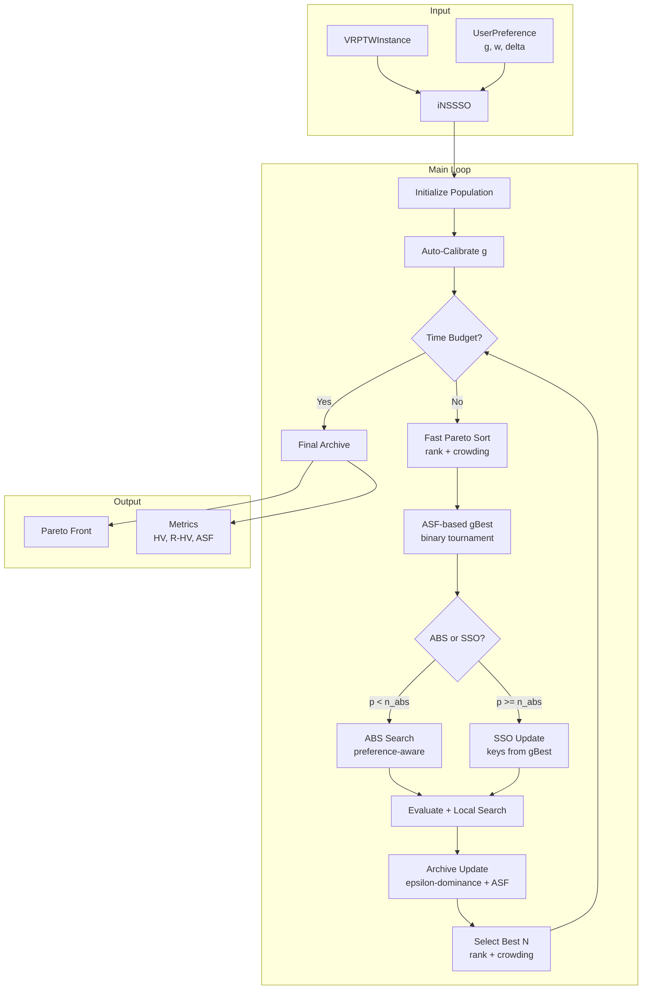
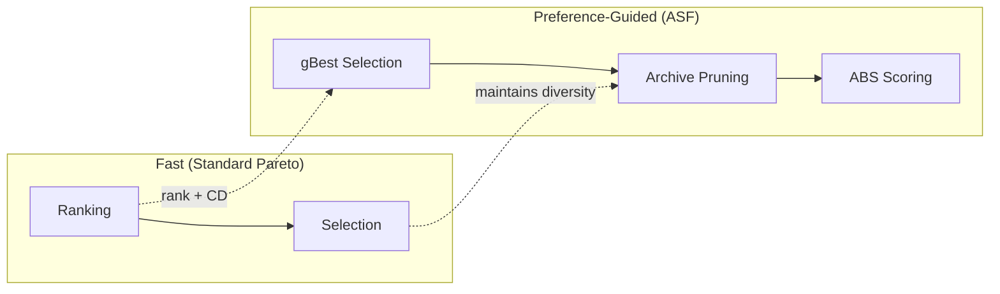

# Thiết kế Chi tiết: Preference-Based iNSSSO cho MO-VRPTW

## 1. Tổng quan

**iNSSSO** (improved Non-dominated Sorting Squirrel Search Optimization) là thuật toán meta-heuristic đa mục tiêu giải bài toán **MO-VRPTW** (Multi-Objective Vehicle Routing Problem with Time Windows) với 3 mục tiêu:

| Mục tiêu | Ký hiệu | Mô tả |
|-----------|---------|-------|
| Quãng đường | $f_1$ | Tổng khoảng cách di chuyển |
| Thời gian chờ | $f_2$ | Tổng thời gian chờ tại customers |
| Độ lệch tải trọng | $f_3$ | Chênh lệch makespan giữa các routes |

**Đặc trưng chính**: Kết hợp Pareto sort (đảm bảo đa dạng) + ASF-guided gBest (hướng tìm kiếm tới vùng ưu tiên) — **Hybrid Preference Strategy**.

---

## 2. Kiến trúc Hệ thống



---

## 3. Preference Parameters

### 3.1. Reference Point — $g = [g_1, g_2, g_3]$

Điểm kỳ vọng cho từng mục tiêu. Ví dụ: $g = [830, 0.5, 0.15]$ nghĩa là "tôi muốn quãng đường ~830, thời gian chờ ~0.5, độ lệch ~0.15."

> [!IMPORTANT]
> **Auto-Calibration**: g được tự động tính từ initial population:
> $g = ideal + 0.1 \times \max(p_{10} - ideal, 0)$
> với $ideal$ = min per objective, $p_{10}$ = 10th percentile. Chỉ dùng feasible solutions (restcus == 0).

### 3.2. Weight Vector — $w = [w_1, w_2, w_3]$, $\sum w_i = 1$

Tầm quan trọng tương đối của mỗi mục tiêu. Ví dụ: $w = [0.5, 0.3, 0.2]$ — quãng đường quan trọng nhất.

### 3.3. ROI Delta — $\delta$

Bán kính vùng ưu tiên (Region of Interest). Nhỏ = tập trung sát g, lớn = vùng rộng hơn.

**ROI check**: Solution $x$ nằm trong ROI nếu:
$$\sum_i \left( \frac{w_i \cdot (f_i(x) - g_i)}{\delta \cdot (nadir_i - ideal_i)} \right)^2 \leq 1$$

Định nghĩa trong [preference.py](file:///d:/LuanVanThs/code/core/preference.py).

---

## 4. Achievement Scalarizing Function (ASF)

$$ASF(x, g, w) = \max_{i=1..3} \{ w_i \cdot (f_i(x) - g_i) \}$$

- **Ý nghĩa**: Đo "deviation tệ nhất" từ g theo trọng số → càng nhỏ càng tốt
- **Augmented ASF** (tie-breaking): $ASF_{aug} = \max\{...\} + \rho \cdot \sum w_i(f_i - g_i)$ với $\rho = 10^{-3}$
- **Batch**: Vectorised cho toàn bộ population cùng lúc

**Vai trò trong thuật toán**:
1. **gBest Selection**: chọn leader có ASF nhỏ nhất
2. **Archive Pruning**: khi archive đầy, giữ solutions có ASF thấp
3. **Stagnation Detection**: theo dõi best ASF qua các thế hệ
4. **Convergence Tracking**: log min(ASF) thay vì IGD proxy

---

## 5. Hybrid Preference Strategy

### Tại sao Hybrid?

| Phương pháp | Ưu | Nhược |
|-------------|-----|-------|
| Full R-Dominance | Hội tụ mạnh quanh g | O(N²) rất chậm, mất đa dạng |
| Pure Pareto | Nhanh, đa dạng | Không hướng tới ưu tiên |
| **Hybrid** | **Vừa nhanh, vừa hướng tới g** | **Cân bằng tốt** |

### Cơ chế Hybrid:



- **Ranking + Selection**: Fast Pareto sort + crowding distance → giữ diversity, throughput cao
- **gBest**: ASF binary tournament trong Pareto front rank-0 → hướng SSO tới vùng ưu tiên
- **Archive**: ε-dominance + ASF tie-breaking → lưu solutions gần g
- **ABS**: Composite score `w₁*dist + w₂*tw_urgency + w₃*balance` → route building theo ưu tiên

---

## 6. Main Loop Chi tiết

### 6.1. Initialization

```
1. best_initialization(instance, time_limit=40%*t_run or 15s)
2. Diverse seeds: insertion(6 sort keys) + Clarke-Wright + nearest-neighbor
3. Perturbations: noise_scale ∈ {0.05, 0.10, 0.15} per seed
4. Fill remaining with random solutions
5. AUTO-CALIBRATE g from feasible solutions
```

Hàm: [initialize_population](file:///d:/LuanVanThs/code/algorithm/inssso.py#L221-L285)

### 6.2. Per-Generation Loop

```
FOR each generation UNTIL time budget:
  1. RANK population (fast_nondominated_sort + crowding_distance)
  2. SELECT gBest (ASF binary tournament from rank-0)
  3. FOR each solution i:
     IF random < n_abs:
       offspring[i] = ABS_search(population[i])     ← preference-aware
     ELSE:
       offspring[i] = SSO_update(population[i], gBest)  ← guided by ASF
       IF stagnating: polynomial_mutation(offspring[i])
     EVALUATE offspring[i]
     IF rank-0 AND random < ls_rate: local_search(offspring[i])
  4. UPDATE archive with offspring (ε-dominance + ASF)
  5. INJECT 1 archive solution into offspring (diversity)
  6. MERGE population + offspring → SELECT best N (rank + CD)
  7. ADAPT parameters (n_abs, mutation_rate)
```

### 6.3. SSO Update (Eq. 2 — Squirrel Search)

$$x_{i,j}^{new} = \begin{cases}
g_{best,j} & \text{if } \rho_j \leq c_g \\
x_{i,j} & \text{if } c_g < \rho_j \leq c_w \\
rand(0,1) & \text{if } \rho_j > c_w
\end{cases}$$

- $c_g = 0.95$: xác suất copy từ gBest (cao → khai thác mạnh)
- $c_w = 0.99$: xác suất giữ nguyên key (cao → ít random)

### 6.4. ABS Search (Preference-Aware)

Destroy-and-rebuild local search:

```
DESTROY:
  40% chance: worst_removal (remove customers causing most distance)
  60% chance: route_removal (remove entire short routes)

REBUILD:
  build_route() with preference-weighted composite score:
    f = w₁ × distance_normalized
      + w₂ × tw_urgency_normalized
      + (1 - w₁ - w₂) × reachability_normalized

POST-PROCESS:
  regret-2 insertion for remaining unassigned
  quick 2-opt on rebuilt routes
```

Định nghĩa trong [abs_search.py](file:///d:/LuanVanThs/code/algorithm/abs_search.py).

### 6.5. Adaptive Parameters

| Parameter | Base | Stagnation | Later stages |
|-----------|------|------------|--------------|
| `n_abs` | 0.20 | +0.05 per stag count (max 0.50) | — |
| `mutation_rate` | 0.05 | — | +0.10 × progress |
| `ls_rate_rank0` | 0.15 (rank-0), 0.03 (others) | — | — |

Stagnation = best ASF không cải thiện trong 5+ thế hệ liên tiếp.

---

## 7. External Archive

### ε-Dominance

Solution mới chỉ được thêm nếu:
1. Không bị dominated bởi member nào trong archive
2. Nếu cùng ε-box → giữ solution có **ASF nhỏ hơn**
3. Nếu archive đầy → prune bằng ASF score (giữ solutions gần g)

$$\epsilon\text{-box}(x) = \lfloor f_i(x) / \epsilon \rfloor$$

### Pruning Strategy (khi archive > max_size)

```python
if preference:
    # Sort by ASF, keep top max_size
    sorted_by_asf[:max_size]
else:
    # Sort by crowding distance (diversity)
    sorted_by_cd[:max_size]
```

---

## 8. Metrics

| Metric | Ý nghĩa | Tính từ |
|--------|---------|---------|
| **HV** | Hypervolume toàn Pareto front | pymoo HV indicator |
| **R-HV** | HV chỉ trong ROI | lọc ROI → normalize → HV |
| **Best ASF** | ASF nhỏ nhất trong PF | $\min_x ASF(x, g, w)$ |
| **ROI Count** | Số solutions trong ROI | [roi_mask()](file:///d:/LuanVanThs/code/core/preference.py#117-127) |
| **Nnds** | Số non-dominated solutions | [fast_nondominated_sort](file:///d:/LuanVanThs/code/algorithm/nondominated.py#38-87) |

Định nghĩa trong [metrics.py](file:///d:/LuanVanThs/code/benchmark/metrics.py).

---

## 9. Kết quả Thực nghiệm

| Instance | Gen | PF | ROI% | R-HV | Best ASF | Best f₁ |
|----------|-----|-----|------|------|----------|---------|
| **C101** (30s) | 72 | 4 | 100% | 0.306 | 0.011 | 828.94 |
| **C104** (30s) | 86 | 44 | 98% | 1.138 | 0.229 | 825.96 |
| **R101** (30s) | 19 | 39 | 97% | 0.764 | 0.364 | 1654.57 |
| **R112** (500s) | 952 | 140 | 100% | 0.846 | 0.224 | 999.26 |

---

## 10. File Structure

```
core/
  preference.py      ← UserPreference, ASF, ROI
  problem.py         ← VRPTWInstance
  solution.py        ← Solution encoding/decoding
  objectives.py      ← FitnessEvaluator (f1, f2, f3)

algorithm/
  inssso.py          ← Main loop, ParetoArchive, hybrid strategy
  r_dominance.py     ← R-Dominance sort (available but not used in hybrid)
  abs_search.py      ← ABS with preference-weighted scoring
  crowding.py        ← Crowding distance, select_best, select_gbest
  nondominated.py    ← Vectorised fast_nondominated_sort

benchmark/
  metrics.py         ← HV, R-HV, ASF, ROI Count, Nnds

config/
  params.yaml        ← Algorithm + preference parameters
```
